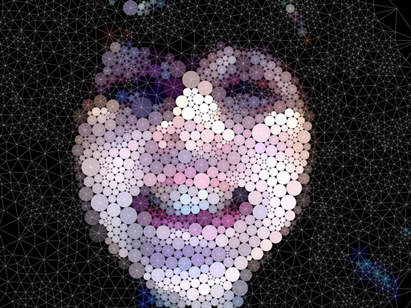

name: inverse
layout: true
class: center, middle, inverse
---

# Code as Material
## From Instruction to Expression

#### - Intro -

  
### Prof. Dr. Lena Gieseke | l.gieseke@filmuniversitaet.de  

#### Film University Babelsberg KONRAD WOLF

???

  

* You might think that for doing cool, e.g. visual stuff with coding you need mountains of coding knowledge. That is not true. Even a with a beginners skill level you can do nice things.

Look for example at these different possibilities to do visual designs and even art with just an arrangement of circles!

---
layout:false

.center[ .imgref[[[Circle Packing, Miu Ling Lam, 2010]](https://miulinglam.files.wordpress.com/2010/02/cp09.jpg)]]

???
  

* https://editor.p5js.org/
* Show circle

---

.center[ .imgref[[[Circle Packing, Miu Ling Lam, 2010]](https://miulinglam.files.wordpress.com/2010/02/cp10.jpg)]]

---

.center[  .imgref[[[miulinglam]](https://miulinglam.files.wordpress.com/2010/02/cp09.jpg)]   
Verschiedene Kreise (1926), Wassily Kandinsky] 

---

.center[  .imgref[[[miulinglam]](https://miulinglam.files.wordpress.com/2010/02/cp09.jpg)]   
Komposition mit Kreisen und Linien (1926), Wassily Kandinsky] 

???

  

https://openprocessing.org/sketch/522693
https://openprocessing.org/sketch/1493313
https://openprocessing.org/sketch/1633118

* Look for simple geometric art in the next week and see what makes it appealing.

---
layout:false

## Learning Objectives

With this course, you will gain

--

* An understanding of programming

--

* **Skills to develop simple programs from scratch**
    * Knowledge about resources
    * Guidance towards and learning through self-studies

--

* Skills to apply programming as (an expressive) tool

???
  

* But it is like a poetry class in Japanese

---

## Topics

???
* In regard to programming itself, we will cover

--

.left-even[
Programming:

* Commands, variables
* Events
* Conditions
* Loops
* Arrays
* Functions

*How to think?*
]

???

  

* Class topics can be divided into what you learn about programming itself and its *syntax* and what you do with your newly developed programming skill, meaning its application.
  
We apply these programming skills to implement:

--

.right-even[
Application:

* Drawings, colors
* Interaction
* Movement / Animation
* Image, video
* Sound
  
What is *creative* coding?
]

???

TODO: add line sketch

---
template:inverse

# Introductions

---
## Who am I?

--

* Bachelor in Computer Science (Vordiplom)
* Master in Fine Art (MFA Dramatic Media)
* 6 years in the industry (VFX, R&D, Software Development)
* Phd in Computer Science (Dr. rer. nat. Computer Graphics)

--

 

* Film University Babelsberg KONRAD WOLF, Potsdam, Germany
* Professor for Image-based Media Technologies
* MA Creative Technologies

---
## MA Creative Technologies

> Computer Science meets Creativity, Art & Film...

--

.center[]  

[Filmuni Website ⇗](https://www.filmuniversitaet.de/en/studies/study-programs/master-programs/creative-technologies)

---
## MA Creative Technologies

> Computer Science meets Creativity, Art & Film...

.center[]  

[Instagram: ctech.filmuniversity ⇗](https://www.instagram.com/ctech.filmuniversity/)

---
## Film University Babelsberg KONRAD WOLF

--

* Largest film school in Germany (established 1954), now public university

--

* About 100 in-house film productions yearly

--

* State-of-the-art equipment and environments (2 studios, 150 and 300 sqm)

.center[ .imgref[[Image: [Filmuni](https://www.filmuniversitaet.de/filmuni/gebaeude-infrastruktur/studios-und-technik)]]]

???
* e.g., Sony F55, ARRI Alexa, Panasonic VariCam, Harrison MPC4D console with Dolby Atmos
* ceiling lighting rigs

---
## Film University Babelsberg KONRAD WOLF

.left-quarter[
Neighbor: Babelsberg Film Studio, oldest large-scale film studio in the world, producing films since 1912.
]
.right-quarter[ .imgref[[Image: [Studio Babelsberg](https://www.metropolitanbacklot.com/galerie/)]]]

???
* Hundreds of films, including Fritz Lang's Metropolis and Josef von Sternberg's The Blue Angel were filmed there. More recent productions include V for Vendetta, Captain America: Civil War, Æon Flux, The Bourne Ultimatum, Valkyrie, Inglourious Basterds, Cloud Atlas, The Grand Budapest Hotel, The Hunger Games, Isle of Dogs and The Matrix Resurrections. 

---
template: inverse

# Administration

---
.header[Administration]

## Schedule

* 17/03, 14.00 - 18.00 (4h): workshop (room 32)  
* 18/03, 12.00 - 14.00 (2 h): lecture (CIB)  
* 18/03, 16.00 - 18.00 (2 h): workshop (room 32)  
* 19/03, 14.00 - 18.00 (4h): workshop (room 32)  
* 20/03, 14.00 - 18.00 (4h): workshop (room 32)  

---
.header[Administration]

## Materials

--

TODO: add QR Code

All materials are published on the [course website](https://lenagieseke.github.io/workshop_codeasmaterial/)

* Usually before class, the material for that day is uploaded

--
  
 
  
All coding is done in with the [p5.js Editor](https://editor.p5js.org/)

* **Please sign up for an account!**

---

## Administration

> Any further questions?

---
template: inverse

# Today

---
.header[Today]

## Learning Objectives

Today, you will

--

* know what to expect from the course (✓),

--

* be able to work with the p5 online editor,

--

* understand function calls, and

--

* be able to draw stuff.

???
  

* Next week we will look a bit deeper into what programming is, but today we want to get our hands dirty.

---
template:inverse 

# *The End*

### Prof. Dr. Lena Gieseke | l.gieseke@filmuniversitaet.de  

#### Film University Babelsberg KONRAD WOLF
