name: inverse
layout: true
class: center, middle, inverse
---

### Code as Material
## Creative Coding Foundations for Artistic and Design Practices

#### - Intro -

<br />
### Prof. Dr. Lena Gieseke | l.gieseke@filmuniversitaet.de  

#### Film University Babelsberg KONRAD WOLF

<br />
.center[]


???

  

* You might think that for doing cool, e.g. visual stuff with coding you need mountains of coding knowledge. That is not true. Even a with a beginners skill level you can do nice things.

The underlying threat of this class is to think about what you can do with what you have.

Look for example at these different possibilities to do visual designs and even art with just an arrangement of circles!


---
layout:false
.header[Code as Material]

.left-quarter[
```js
circle(...);
```

]
.center[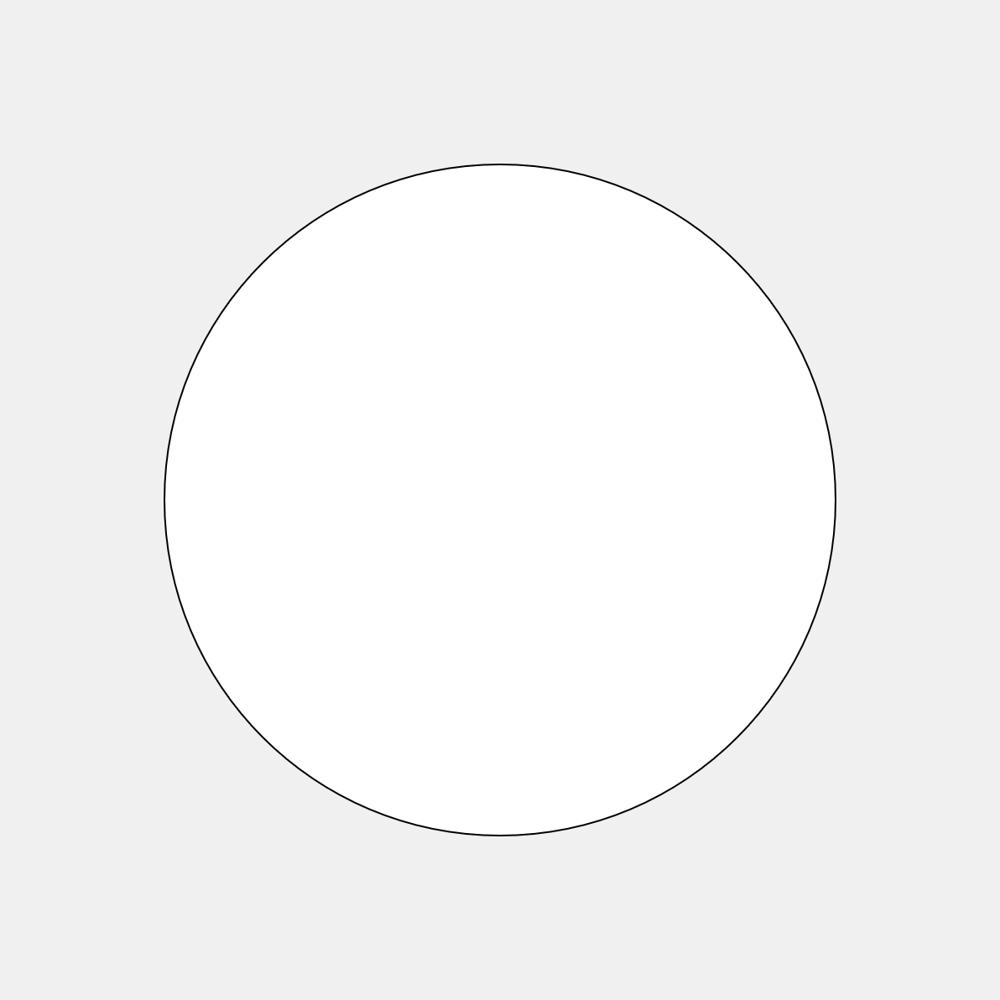]


---
.header[Code as Material]

.center[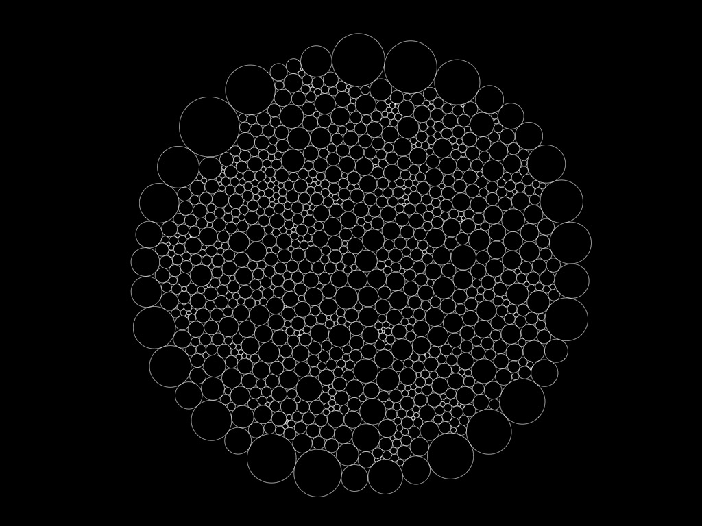 .imgref[[[Circle Packing, Miu Ling Lam, 2010]](https://miulinglam.files.wordpress.com/2010/02/cp09.jpg)]]


---
.header[Code as Material]

.center[
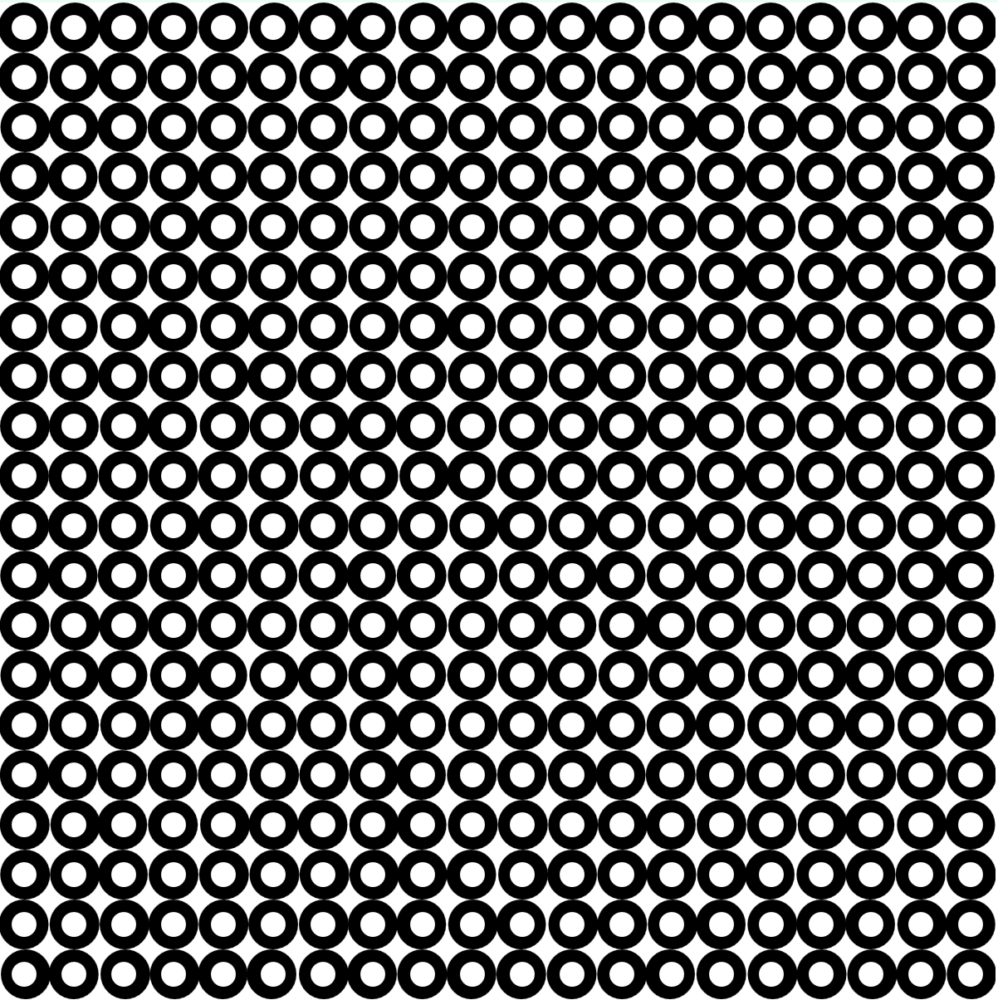
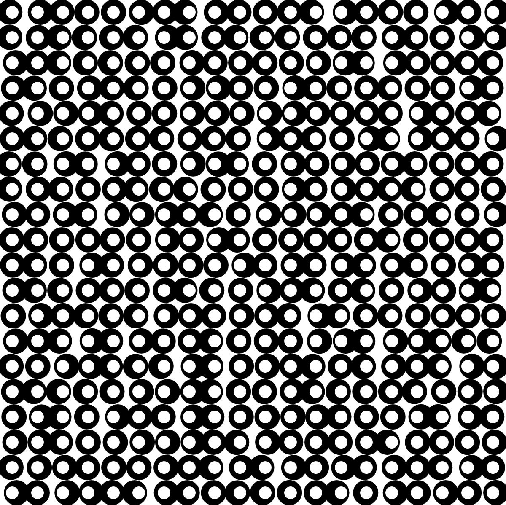
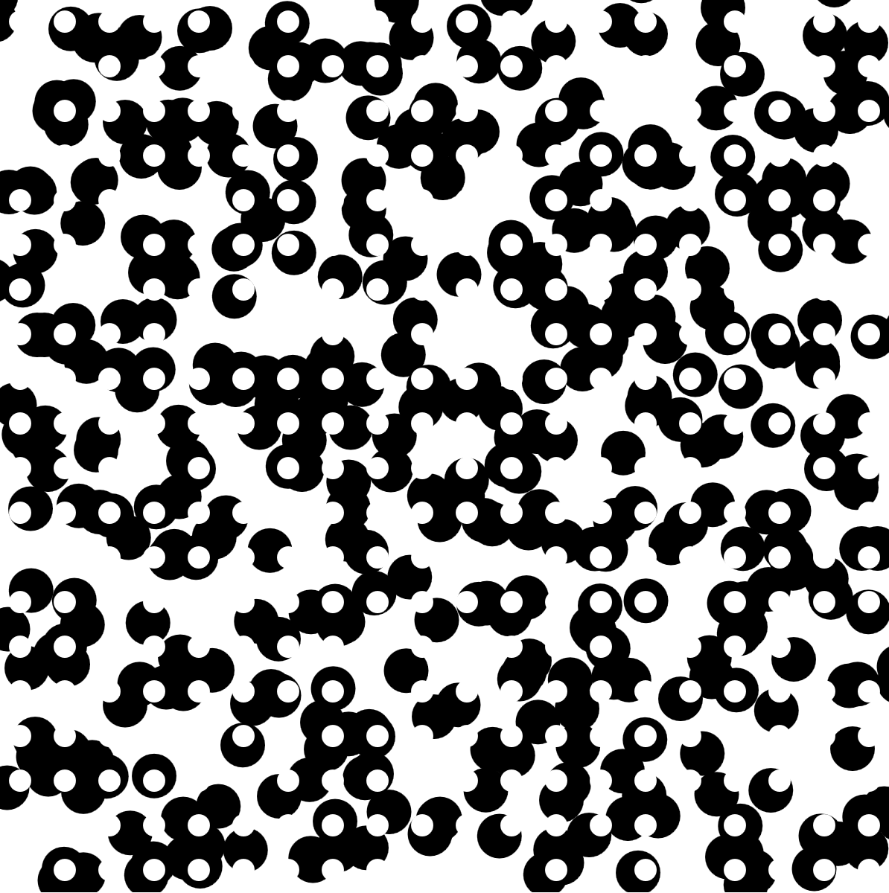  
  
.imgref[[[Images: Generative Design P_2_1_2_02]](http://www.generative-gestaltung.de/2/sketches/?01_P/P_2_1_2_02)]]

???

[https://editor.p5js.org/generative-design/sketches/S1-ggc9qTyE](https://editor.p5js.org/generative-design/sketches/S1-ggc9qTyE)


---
.header[Code as Material]

.center[
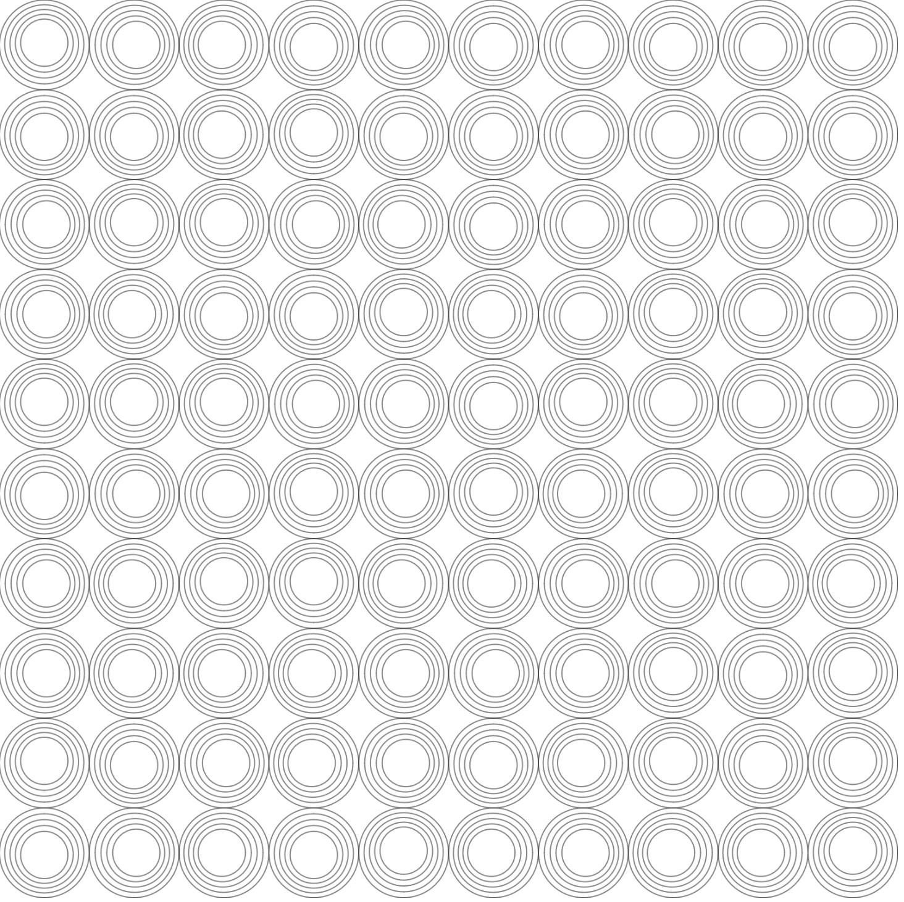
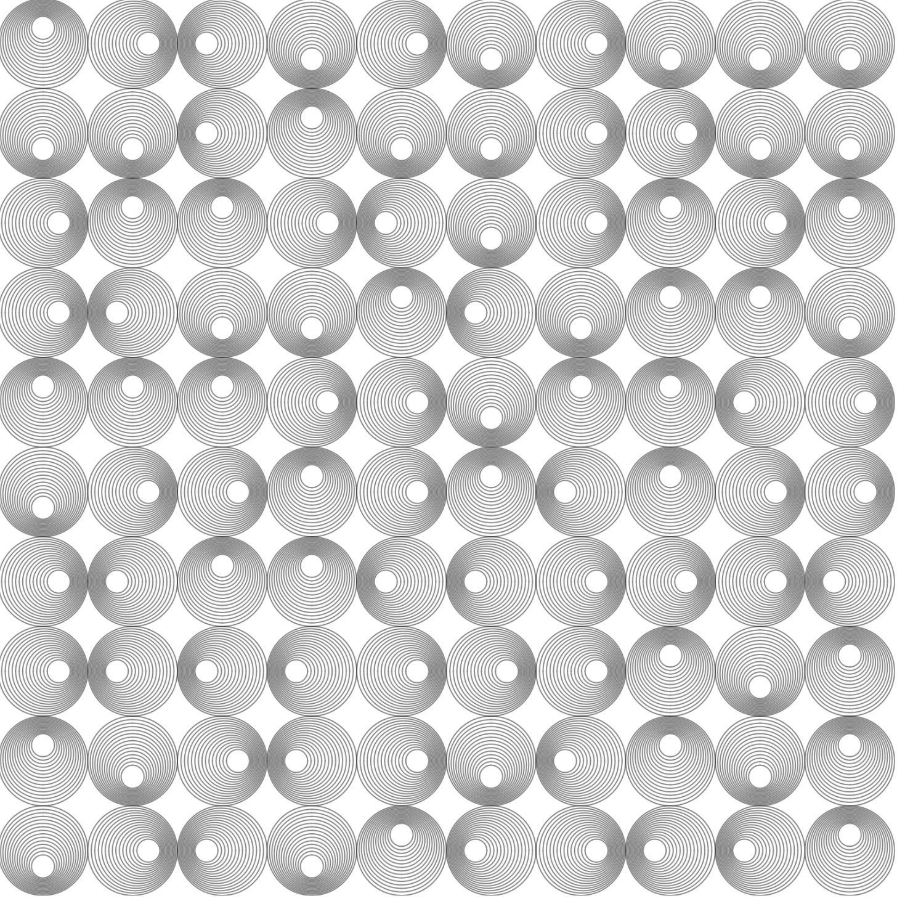
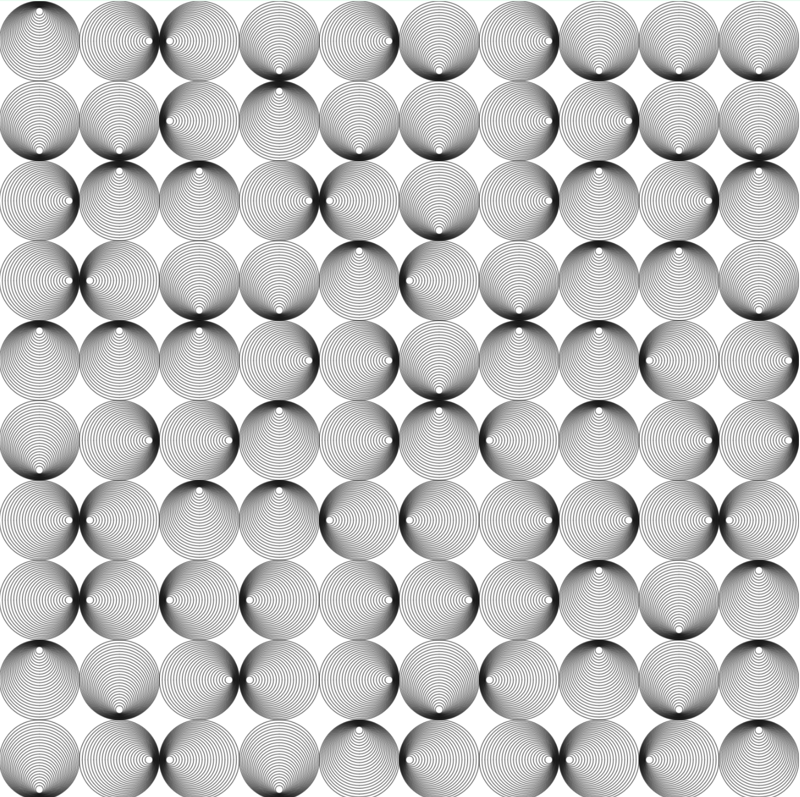  
  
.imgref[[[Images: Generative Design P_2_1_3_01]](http://www.generative-gestaltung.de/2/sketches/?01_P/P_2_1_3_01)]]


???

[https://editor.p5js.org/generative-design/sketches/S1Vlg9cq6y4](https://editor.p5js.org/generative-design/sketches/S1Vlg9cq6y4)


---
.header[Code as Material]

.center[
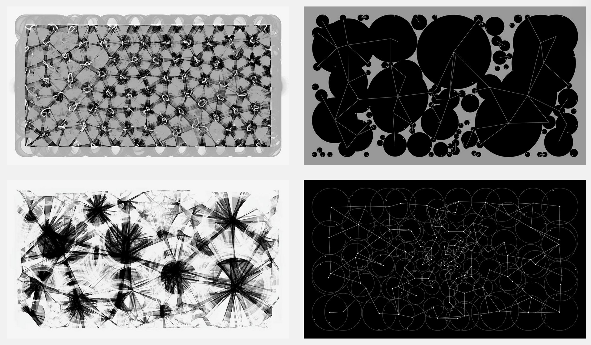  
Pre-Process (Casey Reas, 2022)
.imgref[[[Image: https://reas.com/process]](https://reas.com/process)]]


???

[https://editor.p5js.org/generative-design/sketches/S1-ggc9qTyE](https://editor.p5js.org/generative-design/sketches/S1-ggc9qTyE)


---
.header[Code as Material]

.center[
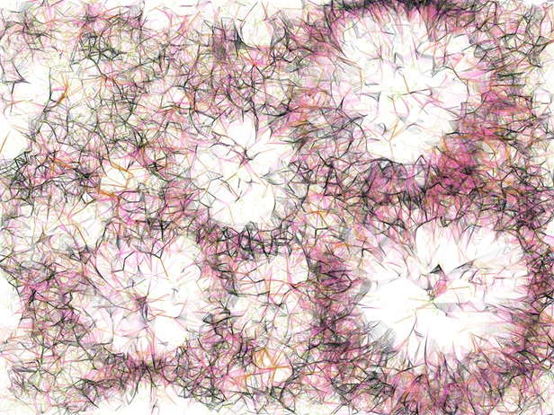
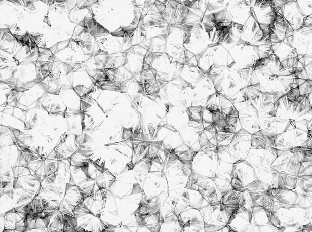  
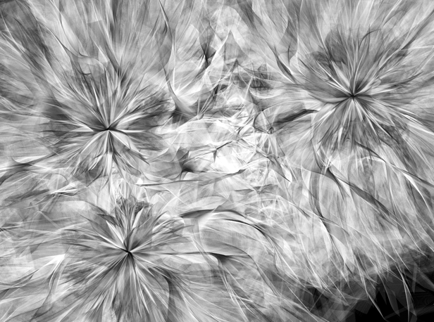
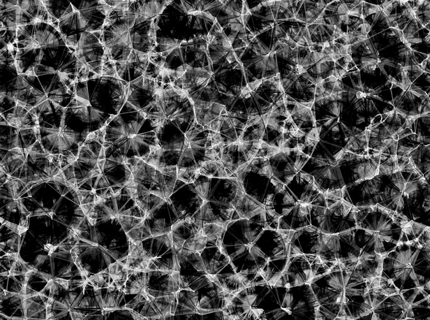  
Process (Casey Reas, 2003 - 25) .imgref[[[Images: Reas Index]](https://index.reas.com/?category=Process)]]

???
* When the circles overlap, you draw a line between their centers
* All lines are formed when two circles overlap

---
.header[Code as Material]

.center[
 <video width="960" controls>
  <source src="./img/intro/reas_process_13.webm" type="video/webm">
</video>   
Process 13 (Casey Reas, 2010) .imgref[[[Video: Process 13 - Casey REAS]](https://vimeo.com/50031370?turnstile=0.aJi63U778uFyBaoUdISFcCJ9ualE3E3KZr8eeHvbt32gJOI0s2RwTpcXtvHQmLrH048Xiwd7z8jyy-kqA_22mzxcm2qAT_2i_NGqeFFStdkVPjqsiWOI6pohYu0LTnb7tN1In40omWBcuZAMLbur4JURHH_oOQgsZF0bWAXaNsfNpb5fSMQVlLhggyCAKut0uWDy3CW2VkvzLd-6sMcbzH9ZXf2J66BpOHKwkP1dRBYoDhKEBS3Lf2weWthfP_2mbqpHzk2BKBcLdYyGfrQn3SkEgeTwujtoeMhc3awuPltKSw0bNnqltirUMzJUmMI_5FxVimjiEfziXTRdFrWcJK91RhEGJsOzaJuF_ccn79qrBOKE0Qr2y-HT_TmMj81zJe2x54ttdI-kpp2ffVU9QV7bvly_c7lRpYhXPhY3IZFewZm-PceYGxhbJyAwU7yRd62GG2D--VIBiA9HdEECP-WuDs69BiXjc0O2o0Ce5o_6TB0GA3JuKlTx-DbMkMwoErPQBl_tRSjcR0dM3eM7MS7JenA-UFh1nler72Vd1bkIZcjxnSbZ75SjnRtIH-4qU4VkhyfjKTNI-LUbLQSwF0W9uS4FNjgDtsmPOYpJPumKx9FLSI32-LpQsixs8nMZ29Swolqa6FJHD7jQcgNIZXToHCYijo2vdTC9sGwx0ihtVtvf5x_kOeAabo8gcoUOTRog6MTk7I8eaE9K0CeBYgIf03X0d6tx3loLrRl2C0Dk0sjuyYDoz6RdTR2aiBym29saxbBKSdyWPXevT53G3MTyURNWb3rpzz70KlyzorjdOMjzLXQNes7StC9UjFU3XImZHB1bK9gCHBEkz7QXRUFUwRsHn2TcBR9uUwT8vSNamOgHG8lyEJJyKU5E4VD5.wGybO0IgvGHkUxwHx8pfGg.d89fd6dec54a37d3fe7b2169f7cbdca2f6ef51441962ce9f8d45cbd43a5b469e)]]


???
* When the circles overlap, you draw a line between their centers
* All lines are formed when two circles overlap
* The rule is that the circles can only start from the bisectional line in the middle


Reas intentionally frames these works as instruction systems rather than fixed algorithms.

The piece is defined by the rules themselves, not by a single canonical implementation. Multiple programs can produce valid realizations. This idea comes directly from conceptual art: instructions generate the artwork rather than a singular object.

In nerdy systems language: the artwork is the behavior space defined by the rule set, not any specific frame rendered on screen.


---
.header[Code as Material]

.center[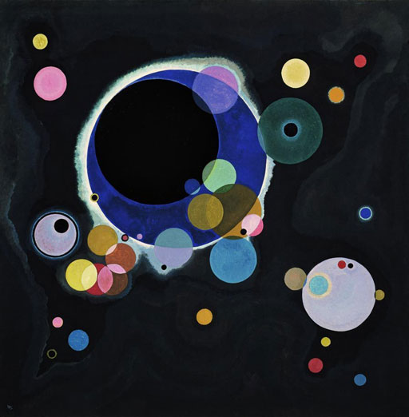  .imgref[[[miulinglam]](https://miulinglam.files.wordpress.com/2010/02/cp09.jpg)]   
Verschiedene Kreise (1926), Wassily Kandinsky] 


---
.header[Code as Material]

.center[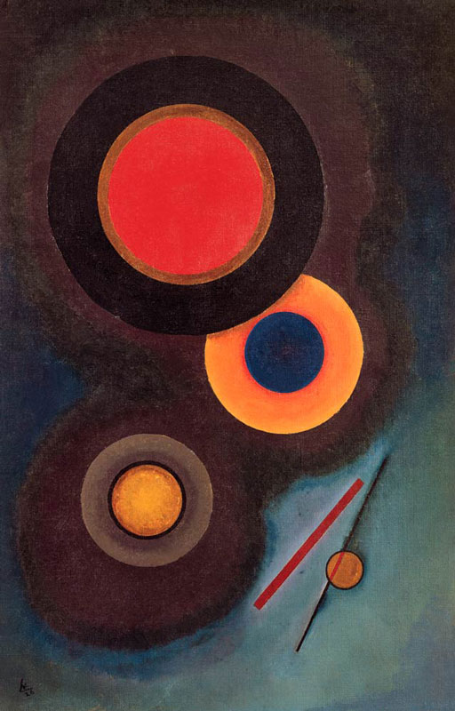  .imgref[[[miulinglam]](https://miulinglam.files.wordpress.com/2010/02/cp09.jpg)]   
Komposition mit Kreisen und Linien (1926), Wassily Kandinsky] 

???

* Look for simple geometric art in the next week and see what makes it appealing.


https://openprocessing.org/sketch/1493313
https://openprocessing.org/sketch/1633118

---
template:inverse

### *What do I have available and what can I do with that?*

???
What do I have available, and what can I make it do?

---
layout:false

## Learning Objectives

With this course, you will gain

--

* An understanding of programming

--

* **Skills to develop simple programs from scratch**
    * Knowledge about resources
    * Guidance towards and learning through self-studies

--

* Skills to apply programming as (an expressive) tool


???
  

* But it is like a poetry class in Japanese

---

## Topics


???
* In regard to programming itself, we will cover

--

.left-even[
Programming:

* Commands, variables
* Events
* Conditions
* Loops
* Arrays
* Functions

*How to think?*
]

???

  

* Class topics can be divided into what you learn about programming itself and its *syntax* and what you do with your newly developed programming skill, meaning its application.
  
We apply these programming skills to implement:

--

.right-even[
Application:

* Drawings, colors
* Interaction
* Movement / Animation
* (Image, video)
* (Sound)
  
What is *creative* coding?
]


---
.header[Code as Material]

.center[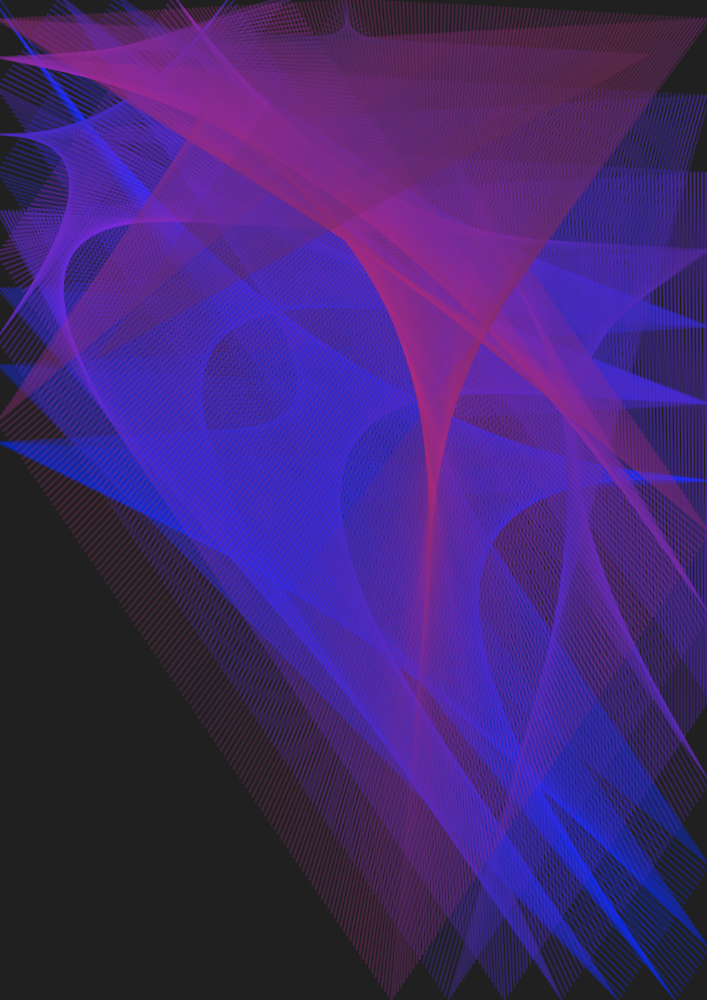]

---
.header[Code as Material]

.center[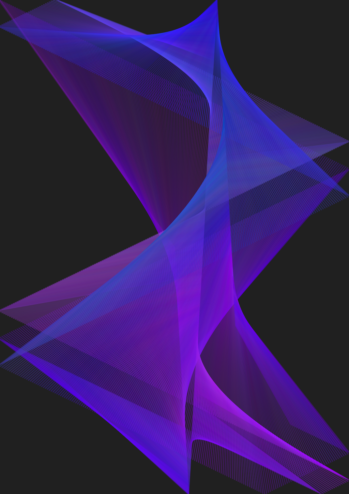]

---
.header[Code as Material]

.center[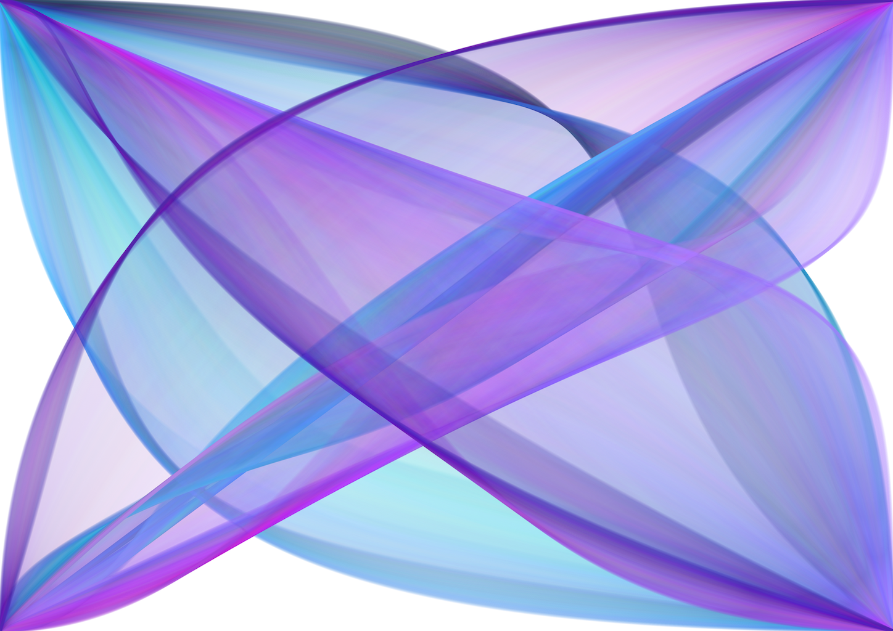]

---
.header[Code as Material]

.center[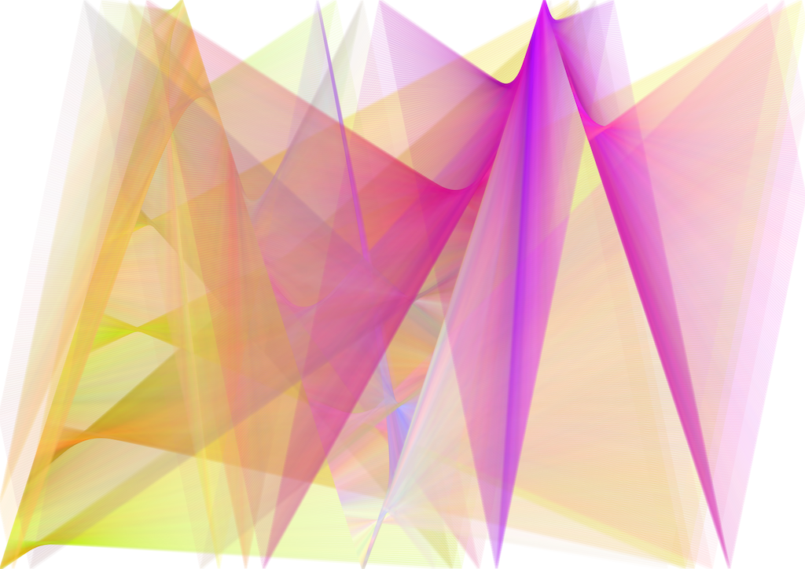]

---
.header[Code as Material]

.center[
 <video width="800" controls>
  <source src="./img/intro/sketch_02.webm" type="video/webm">
</video>  
]

---
template:inverse

# Introductions


---
## Who am I?

--

* Bachelor in Computer Science (Vordiplom)
* Master in Fine Art (MFA Dramatic Media)
* 6 years in the industry (VFX, R&D, Software Development)
* Phd in Computer Science (Dr. rer. nat. Computer Graphics)

--

<br />

* Film University Babelsberg KONRAD WOLF, Potsdam, Germany
* Professor for Image-based Media Technologies
* MA Creative Technologies

---
## MA Creative Technologies

> Computer Science meets Creativity, Art & Film...

--

.center[[](https://www.filmuniversitaet.de/en/studies/study-programs/master-programs/creative-technologies)]  

[Filmuni Website ⇗](https://www.filmuniversitaet.de/en/studies/study-programs/master-programs/creative-technologies)

---
## MA Creative Technologies

> Computer Science meets Creativity, Art & Film...


.center[[](https://www.instagram.com/ctech.filmuniversity/)]  

[Instagram: ctech.filmuniversity ⇗](https://www.instagram.com/ctech.filmuniversity/)


---
## Film University Babelsberg KONRAD WOLF

--

* Largest film school in Germany (established 1954), now public university

--

* About 100 in-house film productions yearly

--

* State-of-the-art equipment and environments (2 studios, 150 and 300 sqm)

.center[ .imgref[[Image: [Filmuni](https://www.filmuniversitaet.de/filmuni/gebaeude-infrastruktur/studios-und-technik)]]]

???
* e.g., Sony F55, ARRI Alexa, Panasonic VariCam, Harrison MPC4D console with Dolby Atmos
* ceiling lighting rigs

---
## Film University Babelsberg KONRAD WOLF

.left-quarter[
Neighbor: Babelsberg Film Studio, oldest large-scale film studio in the world, producing films since 1912.
]
.right-quarter[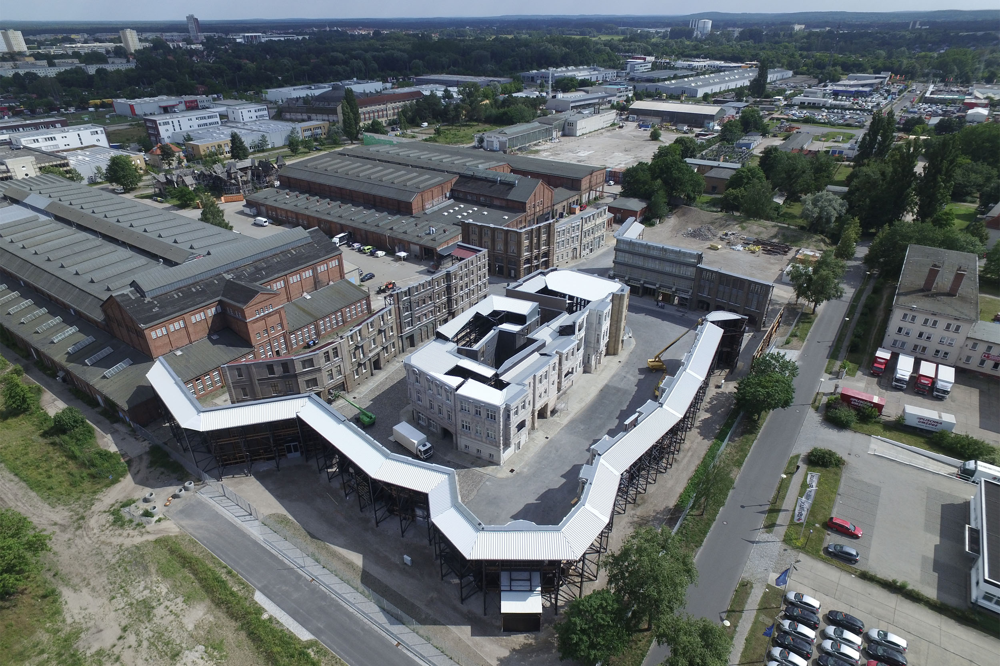 .imgref[[Image: [Studio Babelsberg](https://www.metropolitanbacklot.com/galerie/)]]]


???
* Hundreds of films, including Fritz Lang's Metropolis and Josef von Sternberg's The Blue Angel were filmed there. More recent productions include V for Vendetta, Captain America: Civil War, Æon Flux, The Bourne Ultimatum, Valkyrie, Inglourious Basterds, Cloud Atlas, The Grand Budapest Hotel, The Hunger Games, Isle of Dogs and The Matrix Resurrections. 


---
template: inverse

# Administration

---
.header[Administration]

## Schedule

* 17/03, 14.00 - 18.00 (4h): workshop (room 32)  
* 18/03, 12.00 - 14.00 (2 h): lecture (CIB)  
* 18/03, 16.00 - 18.00 (2 h): workshop (room 32)  
* 19/03, 14.00 - 18.00 (4h): workshop (room 32)  
* 20/03, 14.00 - 18.00 (4h): workshop (room 32)  

---
.header[Administration]

## Materials


All materials are published on the [course website](https://lenagieseke.github.io/workshop_codeasmaterial/)

* Usually before class, the material for that day is uploaded

--
  
<br />
  
All coding is done in with the [p5.js Editor](https://editor.p5js.org/)

* **Please sign up for an account!**


---
.header[Administration | Materials]


[https://lenagieseke.github.io/workshop_codeasmaterial/](https://lenagieseke.github.io/workshop_codeasmaterial/)

.center[[](https://lenagieseke.github.io/workshop_codeasmaterial/)]


---

## Administration

> Any further questions?


---
template: inverse

# Today

---
.header[Today]

## Learning Objectives

Today, you will

--

* know what to expect from the course (✓),

--

* be able to work with the p5 online editor,

--

* understand function calls, and

--

* be able to draw stuff.


???
  

* Next week we will look a bit deeper into what programming is, but today we want to get our hands dirty.

---
template:inverse 

# *The End*


### Prof. Dr. Lena Gieseke | l.gieseke@filmuniversitaet.de  

#### Film University Babelsberg KONRAD WOLF
