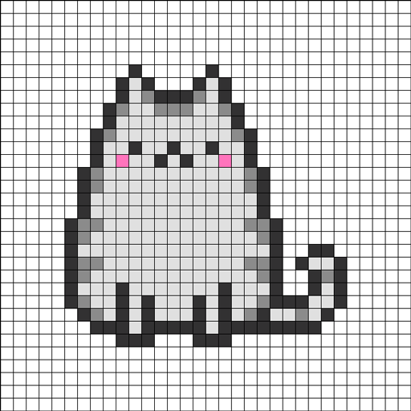
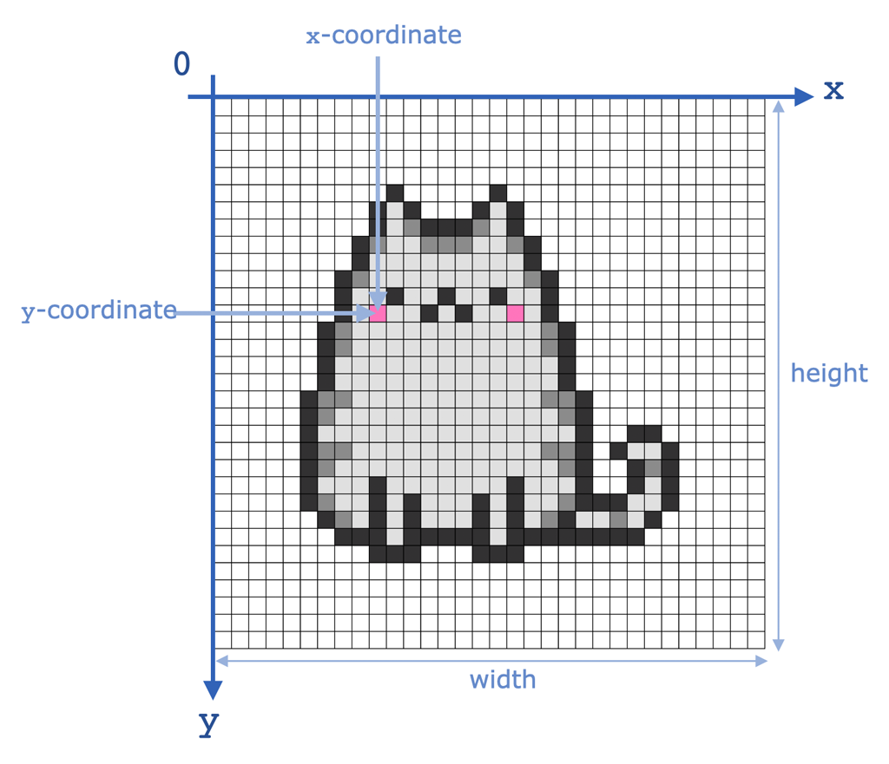
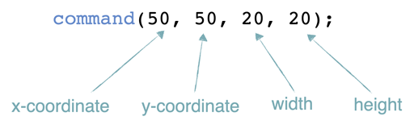
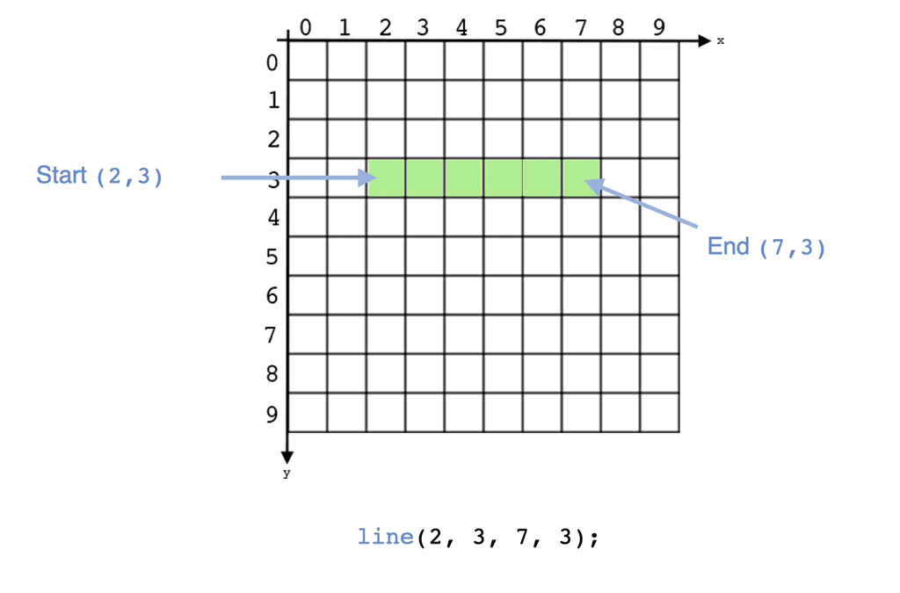
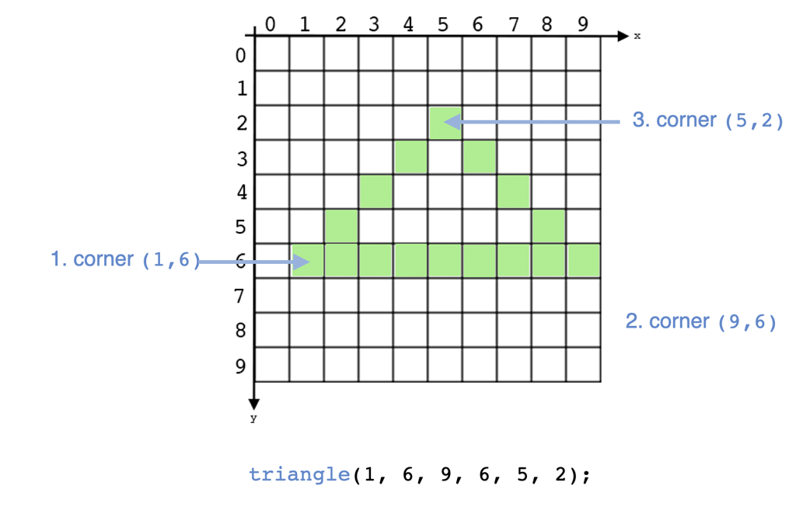
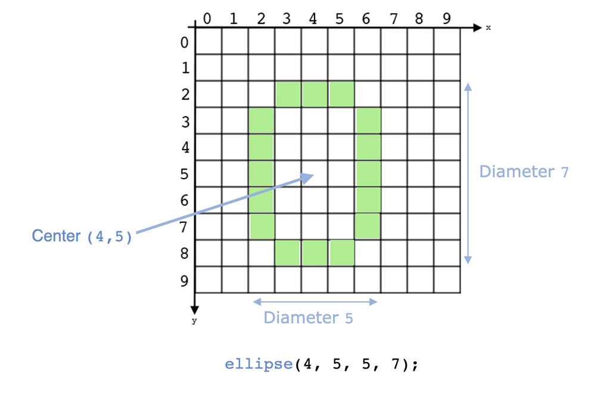
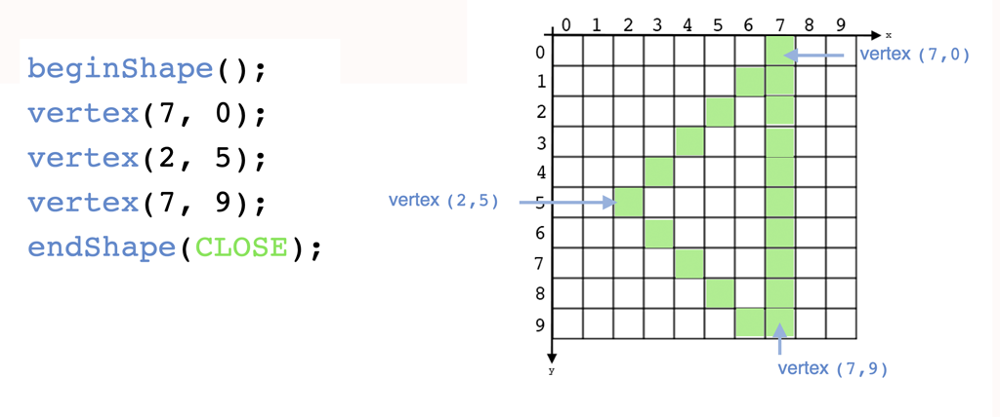
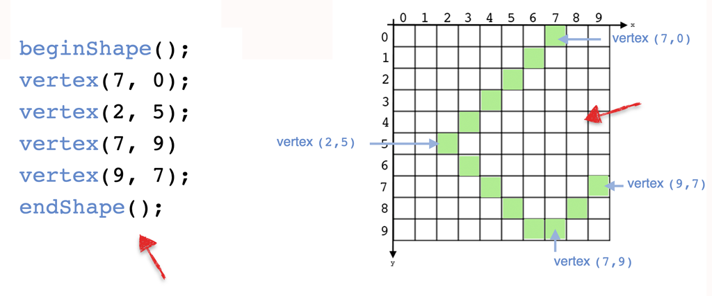
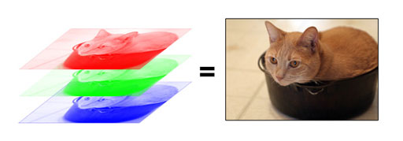
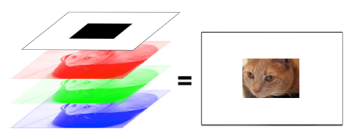

name: inverse
layout: true
class: center, middle, inverse
---

### Code as Material
## Creative Coding Foundations for Artistic and Design Practices

#### - Drawing -

<br />
### Prof. Dr. Lena Gieseke | l.gieseke@filmuniversitaet.de  

#### Film University Babelsberg KONRAD WOLF

<br />
.center[]


---
template:inverse

# Drawing

---
layout: false

## Function Calls


```js
circle(200, 200, 100);
```

--

* The above statement calls the function `circle` and executes it

--
* You can understand a function call as giving a certain command 

--

> Dear p5, please draw a circle at the location 200, 200 with the diameter 100!

--
  
* A program is a list of function calls

---
layout: false

## Function Calls


```js
circle(200, 200, 100);
```


What the function exactly executes must be defined!

--

<br />
For `circle` this done somewhere inside the p5 library:

--

```js
function circle(posX, posY, radius) {

    // Color pixels so that they form a circle
}
```


???
* https://github.com/processing/p5.js/
* 


---
## Function Calls

```js
circle(200, 200, 100);
```


???
Function calls consist of three parts

--

The `name` of the function to call, here `circle`
* Usually the name describes the overall task
* **Draw a circle!**


---
## Function Calls

```js
circle(200, 200, 100);
```


`( )`  
* In the parenthese you can give input data for the task
* Here, we have the three arguments
    * `200, 200` indicate the location **at x=200 and y=200**
    * `100` indicates the **diameter of 100**


---
## Function Calls

```js
circle(200, 200, 100);
```

The semicolon indicates the end of the command
* Semicolons are optional in p5 and JavaScript. I recommend to place them (they are essential in many other programming languages).  


---
## Function Calls

```js
name(argument1, argument2, argument3, ...);
  
OR
  
name();
```

???


```js
print("Hello World!");
```

With `print` you can send text to the console.


.task[TASK:]  

* Show
* This is useful to set checkpoints in your program and to print the values of variables. We will come back to this.
* Why is there a counter counting up in the console when printing?

---
template: inverse

# The System Loop


---
## System Loop

```javascript
function setup() {

    [HERE YOU WRITE YOUR CODE]
}

function draw() {

    [HERE YOU WRITE YOUR CODE]
}
```

???

  

* In p5 a sketch **must** include the following base structure:

---
## System Loop

```javascript
function setup() {

    [HERE YOU WRITE YOUR CODE]
}
```

--

`setup()`

* Executed **once** when the program is **started**
* Do any kind of setup and configuration here

---
## System Loop

```javascript
function draw() {

    [HERE YOU WRITE YOUR CODE]
}
```

--

`draw()`

* Starts soon as setup() is done
* Executed **again and again** until the window is closed or the execution stopped
* By default 60 frames are displayed in a second

???

  

* You have to accept the structure as given from the p5 gods for now. You must not change it and use it exactly as is, with all words and parenthesis.

---
## System Loop

```javascript
function setup() {

    [HERE YOU WRITE YOUR CODE]
}

function draw() {

    [HERE YOU WRITE YOUR CODE]
}
```

You should use this structure with `setup()` and `draw()` in every sketch!  


---
template: inverse

# Drawing

---
.header[Drawing]

## Create Canvas

For being able to display something, you have to create a canvas. You must do that inside the {} of `setup()`:

--

```javascript
function setup() {

    createCanvas(100, 100);

}

function draw() {

}
```


---
.header[Drawing]

## Create Canvas

```js
createCanvas(100, 100);
```

* The values change the size of the canvas
* You can use the variables `windowWidth` and `windowHeight` for automatically detecting the current size of the display window


???
* Show https://editor.p5js.org/


---
.header[Drawing | Canvas]

## Pixel


???
* What is a pixel?

--

.left-even[
* Canvas = is a grid of small rectangles
* Rectangles = pixel (picture element)
* Image = to assign a color to each pixel
]

.right-even[]

---
.header[Drawing | Canvas]

## Pixel


.left-even[
* p5 gives us many convenient drawing functions to color pixels
* No individual pixel-coloring needed!
]

.right-even[]


???
* Thankfully, p5 give us many convenient drawing functions so that we don't have to color each pixel individually.


---
.header[Drawing | Canvas]

## Coordinate (x,y)

.left-even[
A point on the canvas is identified by a (x, y) coordinate based on the following coordinate system:
]

.right-even[]

---
.header[Drawing | Canvas]

## Coordinate (x,y)

.left-even[
*Where is the following point drawn?*

```js
function setup() {

    createCanvas(300, 300);
}

function draw() {

    point(300, 200);
}
```
]

.right-even[]

???
Show in Editor

```
function setup() {

    createCanvas(300, 300);
}

function draw() {

    circle(300, 200, 50);
}
```

---
.header[Drawing]

## Drawing Function Calls

A typical drawing function call (aka *command*) could look for example as follows:
  
<br />



--

**The order of the parameters is fixed and must be followed!**


---
.header[Drawing]

## Line

.left-even[
```js
line(x1, y1, x2, y2);
```

Arguments:

* Start `(x1, y1)`
* End `(x2, y2)`
]

--

.right-even[]

---
.header[Drawing]

## Drawing Function Calls

<script type="text/p5" data-p5-version="1.6.0" data-height="400" data-preview-width="360" >

function setup() {

    createCanvas(300, 300);
    background(200);
}

function draw() {

    line(50, 50, 250, 250);
}
</script>

???
```
function setup() {

    createCanvas(300, 300);
    background(200);
}

function draw() {

    line(50, 50, 250, 250);
}
```


---
.header[Drawing]

## Triangle

.left-even[
```js
triangle(x1, y1, x2, y2, x3, y3)
```

Arguments:

1. corner `(x1, y1)`
2. corner `(x2, y2)`
3. corner `(x3, y3)`
]

--

.right-even[]

---
.header[Drawing]

## Drawing Function Calls

<script type="text/p5" data-p5-version="1.6.0" data-height="400" data-preview-width="360" >
function setup() {
    
    createCanvas(300, 300);
    background(200);
}

function draw() {

    triangle(50, 50, 250, 250, 50, 250);
}
</script>


---
.header[Drawing]

## Ellipse


```js
ellipse(x, y, diameterWidth, diameterHeight);
```

Arguments:

1. Center point x
2. Center point y
3. diameterWidth
4. diameterHeight


---
.header[Drawing]

## Ellipse

.left-even[
```js
ellipse(x, y, diameterWidth, 
                diameterHeight);
```

Arguments:

1. Center point x
2. Center point y
3. diameterWidth
4. diameterHeight
]

.right-even[]

---
.header[Drawing]

## 2D Primitives


* `arc()`
* `ellipse()`
* `circle()`
* `line()`
* `point()`
* `quad()`
* `rect()`
* `square()`
* `triangle()`


---
.header[Drawing]

## Polygon

A number of given vertices are connected with a line:

.center[]

---
.header[Drawing]

## Polygon

* `beginShape` tells Processing that we are giving vertices for a polygon now
* Corners are added with the `vertex` command
* `endShape` ends the definition
    * `CLOSE` tells Processing to close the shape
    * If not given the last and first vertices of the poly are not connected

---
.header[Drawing]

## Polygon

A number of given vertices are connected with a line:

.center[]

---
.header[Drawing]

## Polygon

<script type="text/p5" data-p5-version="1.6.0" data-autoplay data-height="400" data-preview-width="360" >
function setup() {
    createCanvas(300, 300);
}

function draw() {

    beginShape();

    vertex(270, 10);
    vertex(20, 150);
    vertex(240, 280);
    vertex(290, 240);

    endShape();
}
</script>

???
```
function setup() {
    createCanvas(300, 300);
}

function draw() {

    beginShape();

    vertex(270, 10);
    vertex(20, 150);
    vertex(240, 280);
    vertex(290, 240);

    endShape();
}
```


---
template: inverse

# Colors

???

.task[ASK:]  

* What is a color system?

---
.header[Colors]

## RGB

--

By default p5 uses RGBA-color space with

* red, green, blue, alpha
* 0 … 255
* 0 = no color
* 255 = full saturation

--
* `0,0,0` is black, `255, 255, 255` white

---
.header[Colors]

## RGB

```js
[0..255, 0..255, 0..255]
```


.center[ .imgref[[[tutsplus]](http://cdn.tutsplus.com/active/uploads/legacy/tuts/076_rgbShift/Tutorial/1.jpg)]]


---
.header[Colors | RGBA]

## Alpha

```js
[0..255, 0..255, 0..255 , 0..255]
```

* 0 = fully transparent
* 255 = fully opaque

.center[.imgref[[[tutsplus]](http://cdn.tutsplus.com/active/uploads/legacy/tuts/076_rgbShift/Tutorial/1.jpg)]]


---
.header[Colors]

## Color Function Calls

Setting the background color:

```js
background(r, g, b);
```

---
.header[Colors]

## Color Function Calls

<script type="text/p5" data-p5-version="1.6.0" data-autoplay data-height="400" data-preview-width="360" >
function setup() {
    createCanvas(300, 300);
}

function draw() {
    background(0, 255, 0);
}
</script>

???
```
function setup() {
    createCanvas(300, 300);
}

function draw() {
    background(0, 255, 0);
}
```


---
.header[Colors]

## Color Function Calls

Changing attributes of the drawing commands:

```js
fill(r, g, b);

stroke(r, g, b);

strokeWeight(w);
```

---
.header[Colors]

## Color Function Calls

<script type="text/p5" data-p5-version="1.6.0" data-autoplay data-height="400" data-preview-width="360" >
function setup() {
    createCanvas(300, 300);
}

function draw() {
    background(0, 255, 0);

    fill(0, 0, 255);
    stroke(255, 0, 0);
    strokeWeight(5);

    circle(150, 150, 150);
}
</script>

???
```
function setup() {
    createCanvas(300, 300);
}

function draw() {
    background(0, 255, 0);

    fill(0, 0, 255);
    stroke(255, 0, 0);
    strokeWeight(5);

    circle(150, 150, 150);
}
```


---
.header[Colors]

## Color Function Calls

These commands function as “turn on”-button and are valid until overwritten or deactivated.

```js
noFill(); 
noStroke();
```

---

## Color Function Calls - Example


<script type="text/p5" data-p5-version="1.6.0" data-autoplay data-height="500" data-preview-width="380" >
function setup() {
    createCanvas(300, 400);
    // Background color of the canvas
    background(0, 0, 0);
}

function draw() {
    // Rectangle left
    fill(0, 0, 255); 
    noStroke();
    rect(10, 10, 150, 200);

    // Ellipse
    fill(255, 0, 0);
    stroke(255, 255, 255);
    strokeWeight(10);
    ellipse(150, 150, 150, 200);

    // Rectangle right
    fill(255,168,233);
    strokeWeight(20);
    rect(150, 150, 120, 200);
}
</script>

???

```
function setup() {
    createCanvas(300, 400);
    // Background color of the canvas
    background(0, 0, 0);
}

function draw() {
    // Rectangle left
    fill(0, 0, 255); 
    noStroke();
    rect(10, 10, 150, 200);

    // Ellipse
    fill(255, 0, 0);
    stroke(255, 255, 255);
    strokeWeight(10);
    ellipse(150, 150, 150, 200);

    // Rectangle right
    fill(255,168,233);
    strokeWeight(20);
    rect(150, 150, 120, 200);
}
```

---

## Color Function Calls - Example


<script type="text/p5" data-p5-version="1.6.0" data-autoplay data-height="500" data-preview-width="380" >
function setup() {
    createCanvas(300, 400);
    // Background color of the canvas
    background(255, 200, 10);
}

function draw() {
    // Ellipse
    fill(255, 150, 0);
    noStroke();
    ellipse(150, 240, 200, 200);

    // Rectangle ground
    fill(255, 255, 0); 
    rect(0, 250, 500, 250);
}
</script>

???

```
function setup() {
    createCanvas(300, 400);
    // Background color of the canvas
    background(255, 200, 10);
}

function draw() {
    // Ellipse
    fill(255, 150, 0);
    noStroke();
    ellipse(150, 240, 200, 200);

    // Rectangle ground
    fill(255, 255, 0); 
    rect(0, 250, 500, 250);
}
```

---

## Color Function Calls - Example


<script type="text/p5" data-p5-version="1.6.0" data-autoplay data-height="500" data-preview-width="380" >

// https://happycoding.io/tutorials/p5js/calling-functions/rainbow

function setup() {
    createCanvas(400, 420);
    noStroke();
}

function draw() {
    // red
    fill(255, 0, 0);
    rect(0, 0, 400, 60);

    // orange
    fill(255, 165, 0);
    rect(0, 60, 400, 60);

    // yellow
    fill(255, 255, 0);
    rect(0, 120, 400, 60);

    // green
    fill(0, 255, 0);
    rect(0, 180, 400, 60);

    // blue
    fill(0, 0, 255);
    rect(0, 240, 400, 60);

    // indigo
    fill(75, 0, 130);
    rect(0, 300, 400, 60);

    // violet
    fill(148, 0, 211);
    rect(0, 360, 400, 60);
}
</script>

???

```
function setup() {
    createCanvas(400, 420);
    noStroke();
}

function draw() {
    // red
    fill(255, 0, 0);
    rect(0, 0, 400, 60);

    // orange
    fill(255, 165, 0);
    rect(0, 60, 400, 60);

    // yellow
    fill(255, 255, 0);
    rect(0, 120, 400, 60);

    // green
    fill(0, 255, 0);
    rect(0, 180, 400, 60);

    // blue
    fill(0, 0, 255);
    rect(0, 240, 400, 60);

    // indigo
    fill(75, 0, 130);
    rect(0, 300, 400, 60);

    // violet
    fill(148, 0, 211);
    rect(0, 360, 400, 60);
}
```

---

## Color Function Calls - Example

<script type="text/p5" data-p5-version="1.6.0" data-autoplay data-height="500" data-preview-width="680" >

// https://happycoding.io/tutorials/p5js/calling-functions/rainbow

function setup() {
    createCanvas(300, 400);
    noFill();
    strokeWeight(20);
}

function draw() {

     // red
    stroke(255, 0, 0);
    arc(150, 200, 280, 280, PI, 2*PI);

    // orange
    stroke(255, 165, 0);
    arc(150, 200, 250, 250, PI, 2*PI);

    // yellow
    stroke(255, 255, 0);
    arc(150, 200, 220, 220, PI, 2*PI);

    // green
    stroke(0, 255, 0);
    arc(150, 200, 190, 190, PI, 2*PI);

    // blue
    stroke(0, 0, 255);
    arc(150, 200, 160, 160, PI, 2*PI);

    // indigo
    stroke(75, 0, 130);
    arc(150, 200, 130, 130, PI, 2*PI);

    // violet
    stroke(148, 0, 211);
    arc(150, 200, 100, 100, PI, 2*PI);
}
</script>

???

```

function setup() {
    createCanvas(300, 400);
    noFill();
    strokeWeight(20);
}

function draw() {

     // red
    stroke(255, 0, 0);
    arc(150, 200, 280, 280, PI, 2*PI);

    // orange
    stroke(255, 165, 0);
    arc(150, 200, 250, 250, PI, 2*PI);

    // yellow
    stroke(255, 255, 0);
    arc(150, 200, 220, 220, PI, 2*PI);

    // green
    stroke(0, 255, 0);
    arc(150, 200, 190, 190, PI, 2*PI);

    // blue
    stroke(0, 0, 255);
    arc(150, 200, 160, 160, PI, 2*PI);

    // indigo
    stroke(75, 0, 130);
    arc(150, 200, 130, 130, PI, 2*PI);

    // violet
    stroke(148, 0, 211);
    arc(150, 200, 100, 100, PI, 2*PI);
}
```


---
template:inverse

# Comments

---

## Comments

Comments are text, which p5 will ignore when executing your script file. 

--

* Crucially important for making code more understandable

--

* Documentation and code testing


---

## Comments

Inline comment:

```js
x = x + 1;  //add border
```
--

Single line comment:

```js
//fill(r, g, b);
//stroke(r, g, b);
//strokeWeight(w); 
```
--

Multiline comment:

```js
/* The following computes... */
```

---

## Comments

<script type="text/p5" data-p5-version="1.6.0" data-autoplay data-height="500" data-preview-width="380" >
function setup() {
    createCanvas(300, 400);
    
    // Background color
    background(255, 200, 10);
}

function draw() {
    
    fill(255, 150, 0); // The Sun
    noStroke();
    //ellipse(150, 240, 200, 200);
    ellipse(150, 200, 200, 200);

    fill(255, 255, 0); // The Water
    rect(0, 250, 500, 250);
}
</script>

---
template:inverse

## *How is one supposed to remember all this?*

---

.center[

<br /><br /><br /><br />

# Look it up in the reference: 
## https://p5js.org/reference/
]

---
.header[The Reference]

## Getting Help 🚒

Look it up in the reference: https://p5js.org/reference/

--

* The reference is like a dictionary of the programming language  

--

* Learning to work with the reference is as important as learning the programming syntax

--

* I recommend to bookmark this page as you will come back to is many, many times

---
.header[The Reference]

## Getting Help 🚒

AI Tools

--
* Get help with **your** code

--
* Try the task yourself first

--
* Often quite verbose and complicated

---
template:inverse

# Programming

---
.header[Programming]

## Rule No. 1

> Get the result you want, do not care about good code!


---
template:inverse

# 🤔
# Questions?


???


## References

[1] [M. Kipp: Vorlesungsskript Grundlagen der Programmierung - 1 Zeichnen, Hochschule Augsburg](http://michaelkipp.de/processing/01%20zeichnen.html)  
[2] [CK-12 Foundation: Trigonometry Concepts - 2.1 Radian Measure](https://www.ck12.org/book/CK-12-Trigonometry-Concepts/section/2.1)  
[3] [Happy Coding](https://happycoding.io/tutorials/p5js/)


---
template:inverse 

# *The End*

### Prof. Dr. Lena Gieseke | l.gieseke@filmuniversitaet.de  

#### Film University Babelsberg KONRAD WOLF

