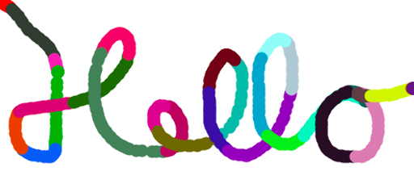
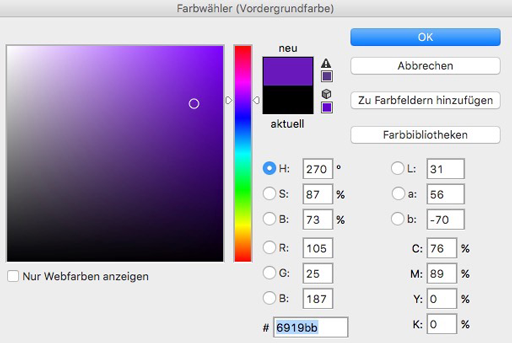

name: inverse
layout: true
class: center, middle, inverse
---

### Code as Material
## Creative Coding Foundations for Artistic and Design Practices

#### - Program Flow & Interaction -

<br />
### Prof. Dr. Lena Gieseke | l.gieseke@filmuniversitaet.de  

#### Film University Babelsberg KONRAD WOLF

<br />
.center[]


---
template:inverse

# Program Flow & Interaction


???
  
* What does this line mean?
* User Interaction is heavily influencing the flow of a program...

---
layout:false

## Program Flow & Interaction

.center[]

---
## Program Flow & Interaction

<script type="text/p5" data-p5-version="1.6.0" data-autoplay data-height="500" data-preview-width="680" >
function setup() {
    createCanvas(360, 360);
    background (255);
    fill(255, 0, 0);
    noStroke();
}

function draw() {
    circle(mouseX, mouseY, 20);
}

// Called if the mouse was pressed
function mousePressed() {

    // Set the fill color to
    // randomly chosen values
    fill(random(255), random(255), random(255));
}
</script>

???
```
function setup() {
    createCanvas(360, 360);
    background (255);
    fill(255, 0, 0);
    noStroke();
}

function draw() {
    circle(mouseX, mouseY, 20);
}

// Called if the mouse was pressed
function mousePressed() {

    // Set the fill color to
    // randomly chosen values
    fill(random(255), random(255), random(255));
}
```

---
.header[Program Flow & Interaction]

## Learning Objectives

With this lecture you re-cap and understand

--

* Code structure and execution

???

* re-cap the basics of how code is structured and executed,

--
* Functions calls

???

* re-cap what function definition and function calls are,

--

* User keyboard and mouse inputs

???

* know how to implement user mouse and key inputs,

--

* Flow control of a program

???

* with that understand how you can control the flow of a program.


---

## Program Flow

--

Execution order of a program:


???

Program flow refers here to the order in which commands and function calls are *executed*.  
--

* Code arrangement does not equal its execution order

???

* How you arrange the code in the code file has little to do with the order in which commands are executed.
--

* Depends on certain syntax, e.g.:

???

* Execution order depends on constructs such as functions, if-, and while-statements.

--
    * {}
    * Function calls
    * User interaction
    * `if`-condition


---
template:inverse

Program Flow 

## Curly Brackets { }

---
.header[Program Flow]

## Curly Brackets `{}`

The most important component for understanding program flow are `{}`:

--
* Create *one block of code*

--
  
* Code inside of the `{}` is executed line by line

---
.header[Program Flow]

## Curly Brackets `{}`

`{}` are attached to different types of *program flow entities*, such as functions:

--

```js
function draw() {

    // Code block 
}
```

--

* *Title line* indicating, what is defined → `function draw()`

???

These entities have a "title line" indicating, what is defined in the following code block, followed by the `{}` for the actual code.

--
* Followed by the actual code → `{ ... }`


---
.header[Program Flow | Curly Brackets `{}`]

## The `if` Statement

We check for a condition to be true:

```js
// Pseudo code

if(condition is true) {

    // do this…
}
```

--
```js
let points = 75;

if (points >= 50) {
    print("you won");
}
```

---
.header[Program Flow | Curly Brackets `{}`]

## The `if` Statement


Once again we have the structure:

```js
// Pseudo code

if(condition is true) { // title line with opening bracket

    // Code

} // Closing bracket 
```


---
.header[Program Flow]

## Curly Brackets `{}`


Get in the habit of directly after writing the opening `{`, to also write the closing `}`.  

???
  
* What does this line mean?
* textThey are BFFs and always, always appear together. Hence, write them together and then fill in the code inside of the brackets in the next step.

---

1.
```js
function draw() {}
```
--

2.
```js
function draw() {

    ellipse();
}
```
--

3.
```js
function draw() {

    ellipse(10, 10, 10, 10);
}
```

---
.header[Program Flow]

## Curly Brackets `{}`

There is NEVER the case that you have only one of the brackets. 

---
.header[Program Flow]

## Curly Brackets `{}`

When trying to understand the flow of a program, look for the brackets first.  

<br />

`{ }` give you an understanding of the different code blocks.

---
.header[Program Flow]

## Curly Brackets `{}`

Within `{}` code is indented! 

```js
... {
    // CODE PUT AFTER 4 SPACES OR 1 TAB
}
```


???
* meaning the layout of the code represents the logic of "code inside of a block":

--
```js
function draw() {

    ellipse(10, 10, 10, 10);
}
```

---
template:inverse

Program Flow 

# Functions

---
.header[Program Flow]

## Functions

So far, we have used different function calls for drawing.

```js
line(10, 10, 50, 50);
```


???
  
* What does this line mean?
* This is the call to the function `line`

--

We are calling the function `line`, which is the task of drawing a line from the point 10, 10 to the point 50, 50.


???

But where is it defined how the line is actually drawn, meaning the coloring of the pixels?

--

<br />

The function is somewhere [inside the p5 library](https://github.com/processing/p5.js/blob/main/src/core/shape/2d_primitives.js) defined. 


???
  
* Similar to if we were baking a pizza and we are using a can of pre-made tomato sauce. `line` is the tomate sauce. We can just use it and do not need to worry about how it is defined.
* But somewhere [inside the p5 library](https://github.com/processing/p5.js/blob/main/src/core/shape/2d_primitives.js) there must be defined what should actually happen if the function `line()` is called. This is called a *function definition*.
* `line()` is a pre-defined function, which we don't have to make from scratch but that we can simply use.


---
.header[Program Flow]

## Function Definition

```js
function functionname() {

    // Code that is executed when we call the function
}
```

* Keyword `function` 
* Individual `functionname`
* `()` with or without parameter
* `{...}` with code inside


???
To define a function you need the keyword `function` followed by a `functionname` (given or of your choice), followed by `()`, followed by `{...}`.  

What a function does is enclosed in the curly brackets.

--

Functions define functionality blocks with fixed responsibilities or tasks.  

---
.header[Program Flow]

## Working With Functions

Working with functions consists of two parts: 

--

1. The definition of that function

--

2. Calling that function to execute it

--

Both steps might be done by p5.


---
.header[Program Flow]

## Custom Functions

With our current knowledge we could define a `line()` function as follow:

```js
function theBestLineEverDrawn(x1, y1, x2, y2) {

    beginShape();
    vertex(x1, y1);
    vertex(x2, y2);
    endShape();
}
```


???

Later on, we will frequently write functions from scratch. Don't worry about writing you own functions for now. Here we are talking about it in order to understand the flow of a program.

To execute what is inside of a function, you have to call it.  

You call a function with its `functionname`, followed by `()`, optional arguments inside of those parenthese, followed by a `;` as last element. We know this already.

--

```js
// Calling the function somewhere in the code
theBestLineEverDrawn(10, 10, 20, 20); 
```

---
.header[Program Flow | Function Call]


<script type="text/p5" data-p5-version="1.11.3" data-autoplay data-height="500" data-preview-width="400" >
  
  
function setup() {
    createCanvas(400, 400);
    background(255, 255, 0);
    strokeWeight(10);
    stroke(0, 0, 255);
}

function draw() {

    line(50, 50,  350, 350);
}
</script>

???

```
function setup() {
    createCanvas(400, 400);
    background(255, 255, 0);
    strokeWeight(10);
    stroke(0, 0, 255);
}

function draw() {

    line(50, 50,  350, 350);
}
```


---
.header[Program Flow | Function Call]


<script type="text/p5" data-p5-version="1.11.3" data-autoplay data-height="500" data-preview-width="400" >

function setup() {
    createCanvas(400, 400);
    background(255, 255, 0);
    strokeWeight(10);
    stroke(0, 0, 255);
}

// Here the function is only defined,
// not yet called
function theBestLineEverDrawn(x1, y1, x2, y2) {
    beginShape();
    vertex(x1, y1);
    vertex(x2, y2);
    endShape();
}

function draw() {
    // Here, we actually call the 
    // function theBestLineEverDrawn and it is
    // executed.
    theBestLineEverDrawn(50, 50, 350, 350);
}
</script>

???

```
function setup() {
    createCanvas(400, 400);
    background(255, 255, 0);
    strokeWeight(10);
    stroke(0, 0, 255);
}

// Here the function is only defined,
// not yet called
function theBestLineEverDrawn(x1, y1, x2, y2) {
    beginShape();
    vertex(x1, y1);
    vertex(x2, y2);
    endShape();
}

function draw() {
    // Here, we actually call the 
    // function theBestLineEverDrawn and it is
    // executed.
    theBestLineEverDrawn(50, 50, 350, 350);
}
```

---
.header[Program Flow | Functions]

## System Loop

```javascript
function setup() {

    [HERE YOU WRITE YOUR CODE]
}

function draw() {

    [HERE YOU WRITE YOUR CODE]
}
```

We define the functions `setup` and `draw` and p5 calls them for us when running a program.


---
template:inverse

# Interaction


???
  
* What does this line mean?
* User Interaction is heavily influencing the flow of a program...


---
.header[Interaction]

<script type="text/p5" data-p5-version="1.11.3" data-autoplay data-height="400" data-preview-width="400" >

function setup() {
    createCanvas(360, 360);
    background (255);
    fill(255, 0, 0);
    noStroke();
}

function draw() {
    circle(180, 180, 100);
}
</script>


???

Everybody who wants to follow along, start with this

```
function setup() {
    createCanvas(360, 360);
    background (255);
    fill(255, 0, 0);
    noStroke();
}

function draw() {
    circle(180, 180, 100);
}
```

--

`draw()` is continuously called and we can make changes to it over time!

--

Such changes could be based on **user interaction**


---
## Mouse Interaction

```js
function mousePressed() {

    // Define what should happen
}
```

--

We define the function that is called by p5 if the mouse is pressed. 

---
## Mouse Interaction


*If the mouse was pressed, change the color of the circle.*  

---
.header[Interaction]

<script type="text/p5" data-p5-version="1.11.3" data-autoplay data-height="500" data-preview-width="400" >

function setup() {
    createCanvas(360, 360);
    background (255);
    fill(255, 0, 0);
    noStroke();
}

function draw() {

    circle(180, 180, 100);
}

function mousePressed() {

    // Define what should happen
}
</script>

???

```
function setup() {
    createCanvas(360, 360);
    background (255);
    fill(255, 0, 0);
    noStroke();
}

function draw() {

    circle(180, 180, 100);
}

function mousePressed() {

    // Define what should happen
}
```

--

*Any ideas?*

--

* If the mouse is pressed, change the color of the circle.

---
.header[Interaction]

<script type="text/p5" data-p5-version="1.11.3" data-autoplay data-height="440" data-preview-width="400" >

function setup() {
    createCanvas(360, 360);
    background (255);
    fill(255, 0, 0);
    noStroke();
}

function draw() {

    circle(180, 180, 100);
}

// Called if the mouse was pressed
function mousePressed() {

    fill(0, 0, 255);
}
  

</script>

???

```
function setup() {
    createCanvas(360, 360);
    background (255);
    fill(255, 0, 0);
    noStroke();
}

function draw() {

    circle(180, 180, 100);
}

// Called if the mouse was pressed
function mousePressed() {

    fill(0, 0, 255);
}
```

---
.header[Interaction]

<script type="text/p5" data-p5-version="1.11.3" data-autoplay data-height="500" data-preview-width="400" >

function setup() {
    createCanvas(360, 360);
    background (255);
    fill(255, 0, 0);
    noStroke();
}

function draw() {

    circle(180, 180, 100);
}

function mousePressed() {

    fill(random(255), random(255), random(255));
}
</script>

???

  
EVERYBODY  

```
function setup() {
    createCanvas(360, 360);
    background (255);
    fill(255, 0, 0);
    noStroke();
}

function draw() {

    circle(180, 180, 100);
}

function mousePressed() {

    fill(random(255), random(255), random(255));
}
```


---
## The `random` Function

--

The random function generates a random number 😁.

```js
random(-50, 50);
```

--

<br />
When we call this function, it *gives* us back a value, the random number.  

---
## The `random` Function

One function can be used in multiple ways:

--

* `random(-5, 5)` returns values between -5 and 5
    * Starting at -5, and up to, but not including, 5
  
--
  
* `random(5)` returns values between 0 and 5 
    * Starting at zero, and up to, but not including, 5


???
* If only one argument is passed to the function, it will return a float between zero and the value of the argument.

  
--
  
<br />
  
#### https://p5js.org/reference/p5/random/ 🚑 🚨


???
  
* What does this line mean?
* Go through reference

---
.header[The `random` Function]

## Function Definition

*Gives* us a value?

--

A function can return data.

---
.header[The `random` Function]

## Function Definition

Somewhere in p5 we have a function definition similar to:

```js
function random(rangeStart, rangeEnd) {
    
    //generate a random number within the range

    return value;
}
```

--

* Keyword `return`
* Custom return value

---
## The `random` Function


We are directly placing the random function where needed...

```js
fill(random(255), random(255), random(255));
```

--

... as `r`, `g`, `b` value for the `fill` command.


--
  
<br />

Hence, functions can be nested. 

> As of now, this should remain an exception for us!


???

```js
let myRed = random(255);
let myGreen = random(255);
let myBlue = random(255);

fill(myRed, myGreen, myBlue);
```


---
.header[Program Flow]

## Careful

*Why does the following not work?*

<script type="text/p5" data-p5-version="1.11.3" data-autoplay data-height="400" data-preview-width="280" >

function setup() {
    createCanvas(360, 360);
    background (255);
    noStroke();
}

function draw() {
    fill(255, 0, 0);
    circle(180, 180, 100);
}

function mousePressed() {
    fill(random(255), random(255), random(255));
}
</script>

???

```
function setup() {
    createCanvas(360, 360);
    background (255);
    noStroke();
}

function draw() {
    fill(255, 0, 0);
    circle(180, 180, 100);
}

function mousePressed() {
    fill(random(255), random(255), random(255));
}
```


---
## Mouse Position

We can also use the current mouse position as input.  

???

This is not done with a function but with two values, so called **variables** provided by p5.  

--
  

With so called **variables** provided by p5:

```js
mouseX
mouseY
```

--
  
This specific type of variable is called *system variable*.  


???
  
* What does this line mean?
* System variable are the variables that are given from the system in contrast to the variables that you are going to define yourself. We will come back to this.

They are given to us by p5 🎁.


--

<br />

> For now you can just remember that "inside" of `mouseX` we can access the current mouse position in x at all times, and in `mouseY` the current mouse position in y.


???
  
* What does this line mean?
* We still need to learn all about variables. This is not the time. 

---
## Mouse Position

<script type="text/p5" data-p5-version="1.11.3" data-autoplay data-height="380" data-preview-width="500" >

function setup() {
    createCanvas(360, 360);
    background (255);
    noStroke();
}

function draw() {
    circle(180, 180, 50);
}

function mousePressed() {
    fill(random(255), random(255), random(255));
}
</script>


???
  
* What does this line mean?
* Where should I put mouseX and mouseY? circle(mouseX, mouseY, 50);

  
EVERYBODY  

```
function setup() {
    createCanvas(360, 360);
    background (255);
    noStroke();
}

function draw() {
    circle(180, 180, 50);
}

function mousePressed() {
    fill(random(255), random(255), random(255));
}
```


---
template:inverse

## Keyboard Interaction


---

## Keyboard Interaction

Similar to the mouse pressed function, we can define what should happen if a key is pressed:

--

```js
function keyPressed() {
    ...
}
```

Again, p5 calls this function for us whenever a key is pressed.

--

```js
// (the rest of the code remains the same)

function keyPressed() {

    fill(255);
}
```

---

## Keyboard Interaction


<script type="text/p5" data-p5-version="1.11.3" data-autoplay data-height="450" data-preview-width="380" >
function setup() {
    createCanvas(360, 360);
    background (255);
    noStroke();
}

function draw() {
    circle(mouseX, mouseY, 100);
}

function mousePressed() {
    fill(random(255), random(255), random(255));
}

function keyPressed() {
    fill(255);
}
</script>


```

function setup() {
    createCanvas(360, 360);
    background (255);
    noStroke();
}

function draw() {
    circle(180, 180, 50);
}

function mousePressed() {
    fill(random(255), random(255), random(255));
}
```


---
template:inverse

# HSB

---

## Nicer Colors

The r, g, b color system is notoriously difficult to control. Thankfully, there are several **color systems** which are easier to work with.

---
.header[Nicer Colors]

## HSB

--

* More intuitive control
* Color gradient


???
HSB gives usually better control over the color and offers a more aesthetic color gradient. The color system's parameter are based on human perception.

---
.header[Nicer Colors]

## HSB

--

* Hue
    * Position on color spectrum 0°..360°

--
  
* Saturation
    * *Amount of color*
    * Ratio color and grey, 0%..100%

--
  
* Brightness
    * Ratio color and black, 0%..100%


---
.header[Nicer Colors | HSB]

.center[]

---
.header[Nicer Colors]

## HSB

In p5 you can set the color system to HSB with:

```js
//https://p5js.org/reference/#/p5/colorMode

colorMode(HSB);

// This sets the channel ranges to the default values of
// H: 0..360
// S: 0..100
// B: 0..100
```

---
.header[Nicer Colors]

## HSB

Also, you can define the value range for all OR each channel:

```js
colorMode(HSB, 100);

// H: 0..100
// S: 0..100
// B: 0..100
```

--
  
```js
colorMode(HSB, 123, 456, 10000);
// H: 0..123
// S: 0..456
// B: 0..10000
```
--
The same function can be called with different arguments!


---
.header[Nicer Colors]

<script type="text/p5" data-p5-version="1.11.3" data-autoplay data-height="500" data-preview-width="400" >

     
function setup() {
    createCanvas(360, 360);
    colorMode(HSB);
    background(100);
    noStroke();
}

function draw() {
    circle(mouseX, mouseY, 100);
}

function mousePressed() {
    fill(random(360), 100, 100);
}

function keyPressed() {
    fill(100);
}
</script>

???

```js
function setup() {
    createCanvas(360, 360);
    colorMode(HSB);
    background(100);
    noStroke();
}

function draw() {
    circle(mouseX, mouseY, 100);
}

function mousePressed() {
    fill(random(360), 100, 100);
}

function keyPressed() {
    fill(100);
}
```


---
template:inverse

## Summary

---
# Summary

* `{}` define blocks of code
    * Indent code inside of the blocks!

---
# Summary

* Functions 
    * Functionality is defined with within `{}`
    * Need to be called in order for the code to execute
--
* We can structure the program flow with user input
    * `mousePressed()`
    * `mouseX`, `mouseY`
    * `keyPressed()`

---
# Summary

* There are two color system: RGB (default) and HSB
    * Set HSB by calling `colorMode(HSB);`
    * You can set custom ranges for each channel  
     `colorMode(HSB, 1000, 100, 100);`

---
template:inverse 

# *The End*


### Prof. Dr. Lena Gieseke | l.gieseke@filmuniversitaet.de  

#### Film University Babelsberg KONRAD WOLF
