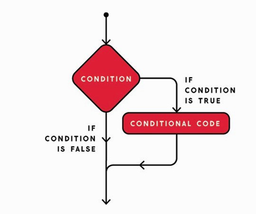
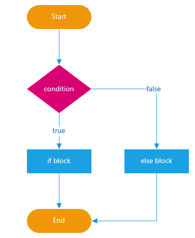
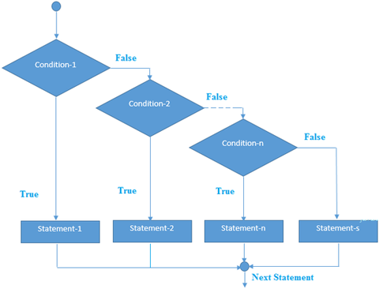

name: inverse
layout: true
class: center, middle, inverse
---

### Code as Material
## Creative Coding Foundations for Artistic and Design Practices

#### - Conditionals -

<br />
### Prof. Dr. Lena Gieseke | l.gieseke@filmuniversitaet.de  

#### Film University Babelsberg KONRAD WOLF

<br />
.center[]


---
layout:false

.header[Example]

<script type="text/p5" data-p5-version="1.11.3" data-autoplay data-height="500" data-preview-width="400" >

     
function setup() {
    createCanvas(360, 360);
    colorMode(HSB);
    background(100);
    noStroke();
}

function draw() {
    ellipse(mouseX, mouseY, 100, 100);
}

function mousePressed() {
    fill(random(360), 100, 100);
}

function keyPressed() {
    fill(100);
}
</script>


???

Everybody should start with that

```
function setup() {
    createCanvas(360, 360);
    colorMode(HSB);
    background(100);
    noStroke();
}

function draw() {
    ellipse(mouseX, mouseY, 100, 100);
}

function mousePressed() {
    fill(random(360), 100, 100);
}

function keyPressed() {
    fill(100);
}
```


---
.header[Interaction | Example]

## How to Clear the Screen?

Idea: Pressing the key ‘c' should clear the screen.

--

<br />

*How to do this?* 😱


--
  

<br />

**Break the problem into subproblems!**

--

* Problem 1: *If the ‘c' key is pressed...*  

--
* Problem 2: *...clear the screen.*

---
.header[Interaction | Example | How to Clear the Screen?]

## Problem 1 - If the ‘c' key is pressed

--

**Break the problem into subproblems!**

--

* Problem 1.1: *Is a key pressed?*

--

* Problem 1.2: *Identify the ‘c' key…*

--

* Problem 1.3: *If it is true...* 

---
.header[Interaction | Example | How to Clear the Screen?]

## Problem 1 - If the ‘c' key is pressed

**Break the problem into subproblems!**


* Problem 1.1: *Is a key pressed?*  ✔️
* Problem 1.2: *Identify the ‘c' key…*
* Problem 1.3: *If it is true...* 


--

Solution to Problem 1.1:

```js
function keyPressed() {

}
```

---
.header[Interaction | Example | How to Clear the Screen?]


<script type="text/p5" data-p5-version="1.11.3" data-autoplay data-height="600" data-preview-width="400" >

     
function setup() {
    createCanvas(360, 360);
    colorMode(HSB);
    background(100);
    noStroke();
}

function draw() {
    ellipse(mouseX, mouseY, 100, 100);
}

function mousePressed() {
    fill(random(360), 100, 100);
}

function keyPressed() {
    
    // WE WORK HERE...
}
</script>


???
  

* How to test this?

```
function setup() {
    createCanvas(360, 360);
    colorMode(HSB);
    background(100);
    noStroke();
}

function draw() {
    ellipse(mouseX, mouseY, 100, 100);
}

function mousePressed() {
    fill(random(360), 100, 100);
}

function keyPressed() {
    
    // WE WORK HERE...
}
```


---
.header[Interaction | Example | How to Clear the Screen?]

## Problem 1 - If the ‘c' key is pressed

Break the problem into subproblems!

* Problem 1.1: *Is a key pressed?*  ✔️
* Problem 1.2: *Identify the ‘c' key…*
* **Problem 1.3: *If it is true...* **


---
template:inverse

Intermezzo Conditionals  
  
## The if Statement

---
.header[Conditionals]

## The `if` Statement

.left-even[
*If something is true… do something.*
  

]

---
.header[Conditionals]

## The `if` Statement

.left-even[
*If something is true… do something.*
  
<br />
  
This is called a **condition**. 
]
--

.right-even[

]


---
.header[Conditionals]

## The `if` Statement

We check for a condition to be true:

```js
// Pseudo code
 
if(condition is true) {

    // do this…
}
```
---
.header[Conditionals]

## The `if` Statement

```js
if(10 > 5) {

    // we will get here
}
```

--
```js
if(10 < 5) {

    // we will never get here
}
```

---
.header[Conditionals]

## The `if` Statement

Once again we have the structure:

```js
// Pseudo code

if(condition is true) { // title line with opening bracket

    // Code

} // Closing bracket without a ;
```

---
.header[Interaction | Example | How to Clear the Screen?]

## Problem 1 - If the ‘c' key is pressed

**Break the problem into subproblems!**


* Problem 1.1: *Is a key pressed?*  ✔️
* Problem 1.2: *Identify the ‘c' key…*
* Problem 1.3: *If it is true...*   ✔️


---
.header[Interaction | Example | How to Clear the Screen?]

## Problem 1.2 - Identify the ‘c' key…


???
* What is our condition?

--

We want to check if the condition "pressed key is c" is true.

--

```js
// Pseudo code

if(pressed key is 'c') {

    Clear the screen…
}
```
---
.header[Interaction | Example | How to Clear the Screen?]

## Problem 1.2 - Identify the ‘c' key…


For knowing which key is pressed, we can use the system variable `key`, kindly provided by p5.

```js
key
```
--

We can compare the variable's value with a specific character

```js
key == 'c'
```

---
template:inverse

Intermezzo

## Textual Data

---
.header[Interaction | Example | How to Clear the Screen?]

## Textual Data

Textural data is represented with `''` around the words or characters.

```js
'I am a text'
'a'
  
print('Hello World!');
```


---
template:inverse

Intermezzo

## The == operator

---

## The == operator

--

This operator tests ***"Is equal?"***

--
* Results in `true` or `false`

--

```
// Pseudo code

1 == 2 -> ?
```

---

## The == operator

This operator tests ***"Is equal?"***

* Results in `true` or `false`


```
// Pseudo code

1 == 2 -> false
```

---

## The == operator

This operator tests ***"Is equal?"***

* Results in `true` or `false`


```
// Pseudo code

1 == 2 -> false
1 == 1 -> ?
```


---

## The == operator

This operator tests ***"Is equal?"***

* Results in `true` or `false`


```
// Pseudo code

1 == 2 -> false
1 == 1 -> true
```


---

## The == operator

This operator tests ***"Is equal?"***

* Results in `true` or `false`


```
// Pseudo code

1 == 2 -> false
1 == 1 -> true
'hello' == 'hello' -> ?
```


---

## The == operator

This operator tests ***"Is equal?"***

* Results in `true` or `false`


```
// Pseudo code

1 == 2 -> false
1 == 1 -> true
'hello' == 'hello' -> true
```


---

## The == operator

This operator tests ***"Is equal?"***

* Results in `true` or `false`


```
// Pseudo code

1 == 2 -> false
1 == 1 -> true
'hello' == 'hello' -> true
'hello' == 'Hello' -> ?
```

---

## The == operator

 
This operator tests ***"Is equal?"***
  
* Results in `true` or `false`


```
// Pseudo code

1 == 2 -> false
1 == 1 -> true
'hello' == 'hello' -> true
'hello' == 'Hello' -> false
```


---

### Other Comparison Operators


| Test                 | Operator |
| -------------------- | -------- |
| Is equal?            | `==`     |
| Is not equal?        | `!=`     |
| Is larger?           | `>`      |
| Is larger or equal?  | `>=`     |
| Is smaller?          | `<`      |
| Is smaller or equal? | `<=`     |

--
```
1 != 2
1 > 1
10 <= 120
```

--
```
1 != 2 -> true
1 > 1 -> false
10 <= 120 -> true
```


---
.header[Interaction | Example | How to Clear the Screen?]

## Problem 1.2: *Identify the ‘c' key…*

```js
key == 'c'
```

---
.header[Interaction | Example | How to Clear the Screen?]

## Problem 1 - If the ‘c' key is pressed

* Problem 1.1: *Is a key pressed?*  ✔️
* Problem 1.2: *Identify the ‘c' key…* ✔️
* Problem 1.3: *If it is true...*   ✔️


--

```js
function keyPressed() {
    
    if(key == 'c'){
        //Clear the screen…
    }
}
```
  
--
  
#### ☝🏻 Always test each newly added code snippet individually!☝🏻

---
.header[Interaction | Example | How to Clear the Screen?]


<script type="text/p5" data-p5-version="1.11.3" data-autoplay data-height="600" data-preview-width="400" >
     
function setup() {
    createCanvas(360, 360);
    colorMode(HSB);
    background(100);
    noStroke();
}

function draw() {
    ellipse(mouseX, mouseY, 100, 100);
}

function mousePressed() {
    fill(random(360), 100, 100);
}

function keyPressed() {
    
    // WE WORK HERE...
}
</script>

???

```
function setup() {
    createCanvas(360, 360);
    colorMode(HSB);
    background(100);
    noStroke();
}

function draw() {
    ellipse(mouseX, mouseY, 100, 100);
}

function mousePressed() {
    fill(random(360), 100, 100);
}

function keyPressed() {
    
    // WE WORK HERE...
}
```


---
.header[Interaction | Example | How to Clear the Screen?]


<script type="text/p5" data-p5-version="1.11.3" data-autoplay data-height="600" data-preview-width="400" >

     
function setup() {
    createCanvas(360, 360);
    colorMode(HSB);
    background(100);
    noStroke();
}

function draw() {
    ellipse(mouseX, mouseY, 100, 100);
}

function mousePressed() {
    fill(random(360), 100, 100);
}

function keyPressed() {
    
    if(key == 'c'){
        print("It's a c!");
    }
}
</script>


???
* https://editor.p5js.org/legie/sketches/_qyVJJgPM

```
function setup() {
    createCanvas(360, 360);
    colorMode(HSB);
    background(100);
    noStroke();
}

function draw() {
    ellipse(mouseX, mouseY, 100, 100);
}

function mousePressed() {
    fill(random(360), 100, 100);
}

function keyPressed() {
    
    if(key == 'c'){
        print("It's a c!");
    }
}
```
  

---
.header[Interaction | Example]

## How to Clear the Screen?

Now we have completed all sub-parts of problem 1!  
  
* Problem 1: *If the ‘c' key is pressed...*   ✔️
    * Problem 1.1: *Is a key pressed?*  
    * Problem 1.2: *Identify the ‘c' key…* 
    * Problem 1.3: *If it is true...*   
* Problem 2: *...clear the screen.*


---
.header[Interaction | Example | How to Clear the Screen?]

## Problem 2 - Clear the Screen

*Any ideas?*

--

Let's just fill the background again...

```js
if(key == 'c') {
    background(100);
}
```

--

Problem 1: If the ‘c' key is pressed ✔️  
Problem 2: Clear the screen ✔️

# 🥳

---
.header[Interaction | Example | How to Clear the Screen?]


<script type="text/p5" data-p5-version="1.11.3" data-autoplay data-height="600" data-preview-width="400" >

     
function setup() {
    createCanvas(360, 360);
    colorMode(HSB);
    background(100);
    noStroke();
}

function draw() {
    ellipse(mouseX, mouseY, 100, 100);
}

function mousePressed() {
    fill(random(360), 100, 100);
}

function keyPressed() {
    
    if(key == 'c'){
        background(100);
    }
}
</script>

???
EVERYBODY
  

```
function setup() {
    createCanvas(360, 360);
    colorMode(HSB);
    background(100);
    noStroke();
}

function draw() {
    ellipse(mouseX, mouseY, 100, 100);
}

function mousePressed() {
    fill(random(360), 100, 100);
}

function keyPressed() {
    
    if(key == 'c'){
        background(100);
    }
}
```

---
.header[Interaction | Example]

## Different Keys?

If it is not the `c` key but the `e` key, paint with white, hence create an eraser.

  
???
* Paint with white.
  
--
  
<br />
  
**Problem: If not condition 1 is true but condition 2 do something else...!**  


---
template:inverse

Intermezzo Conditionals

# The if-else Statement

---
.header[Conditionals]

## The `else` Statement

--

.left-even[
You can also define what should happen if the condition in the `if` statement is not true.  

<br />
For that you need to use `else`.
]

--

.right-even[.imgref[[[ems]](http://mycours.es/ems2/conditionals-if/)]]


---
.header[Conditionals]

## The `else` Statement


```js
if(condition 1 is true){

    // do something

} else if(condition 2 is true){

    // do something else

} else {

    // do a third thing for all other cases
}
```

---
.header[Conditionals]

<script type="text/p5" data-p5-version="1.11.3" data-autoplay data-height="600" data-preview-width="400" >

     
function setup() {
    createCanvas(360, 360);
    colorMode(HSB);
    background(100);
    noStroke();
}

function draw() {
    ellipse(mouseX, mouseY, 100, 100);
}

function mousePressed() {
    fill(random(360), 100, 100);
}

function keyPressed() {
    
    if(key == 'c'){
        background(100);
    }
}
</script>


???


* What to add?

```
    if(key == 'c'){
        
        background(100);

    } else if(key == 'e') {
        
        fill(100);
    }

```

https://editor.p5js.org/legie/sketches/HDWQbzDU8
  
And
```
    if(key == 'c'){

        background(100);

    } else if(key == 'b') {

        background(0);

    } else {

        background(random(100), 100, 100);
    }

```

* Can you explain what is happening here?

---
.header[Conditionals | The `else` Statement]

You can have as many else if statements as you want…

```js
if(value < 10) {

    // For 0, 1, 2, 3, 4, 5, 6, 7, 8, 9

} else if(value < 15) {

    // For 10, 11, 12, 13, 14

} else if(value < 18) {

    // For 15, 16, 17

} else if(value < 20) {

    // For 18, 19

} else {
    // For all values >= 20
}
```

---
.header[Conditionals | The else-if ladder]


.center[]
.imgref[[[quora]]([https://www.quora.com/Can-if-else-be-considered-as-a-loop])]


---
## Conditionals

For a detailed and slow tutorial, see The Coding Train's [3.1: Introduction to Conditional Statements - p5.js Tutorial](https://www.youtube.com/watch?v=1Osb_iGDdjk&t=434s).


???


## One More Operator

With `&` you can chain conditions together:

```js
// Pseudo Code

if(condition1 is true & condition2 is true & condition2 is true) {

}
```

Only if all conditions are true the if-code is entered!


* Explain the following code: https://editor.p5js.org/legie/sketches/0lByVe-mH


---
template:inverse

# Summary

---
# Summary

--
* We can structure the program flow within the code with a conditional statement
  
    * `if(condition is true)`

--
* To create conditions, we use operators

--
    * Comparison
        * `>`, `>=`, `<`, `<=`, `==`, `!=`


???
* Logical Operators
    * `&`, `|`, `!`

--

### Use the [reference](https://p5js.org/reference/) 🚒


???
https://editor.p5js.org/legie/full/EIsuZr5gBI


```
function setup() {
    createCanvas(300, 300);

    // We set the value ranges to run from
    // H:0..300 (same as the width of the canvas)
    // S & B:0..100
    colorMode(HSB, 300, 100, 100);
    background(100);
    //strokeWeight(8);
}

// Without mouse input (see below)
// nothing is happening
function draw() {}


//function mouseDragged() {
function mousePressed() {
  
    strokeWeight(random(2,18));
  
    // Set the color of the line
    // to the hue that is on the 
    // hue color spectrum from 0..300
    // at the x position of the mouse
    stroke(mouseX, 100, 100);
  
    // Draw a line from the top edge of
    // the canvas (y = 0) to the bottom
    // edge of the canvas (y = 300)
    // at the x position of the mouse
    line(mouseX, 0, mouseX, 300);
}
```

```
function mouseDragged() {
  
  if(keyIsPressed & key == 'c'){
    stroke(0,0,100);
  } else {
    stroke(mouseX, 100, 100);
  }
  
  
  strokeWeight(random(1,10));
  line(mouseX, 0, mouseX, 400);
}
```


---
template:inverse 

# *The End*


### Prof. Dr. Lena Gieseke | l.gieseke@filmuniversitaet.de  

#### Film University Babelsberg KONRAD WOLF
