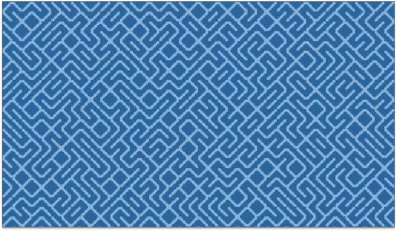
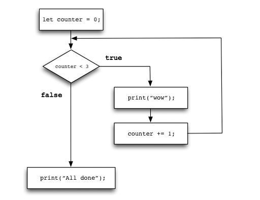
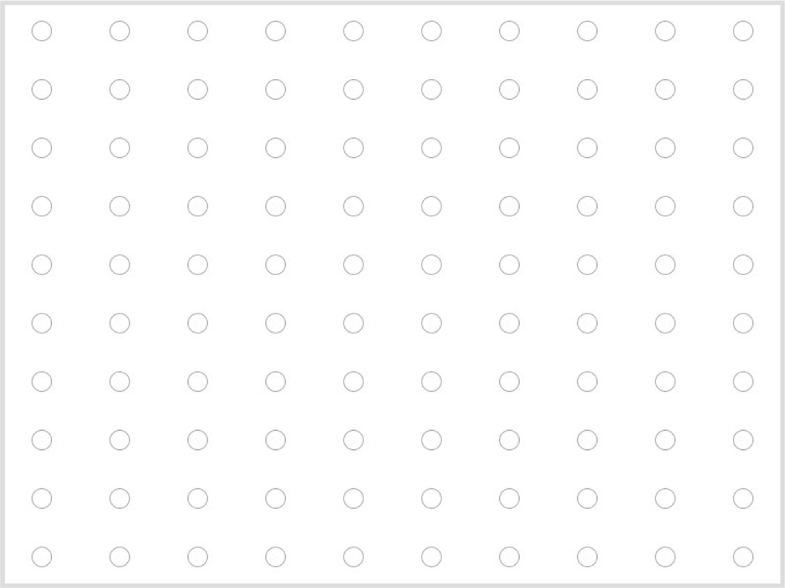
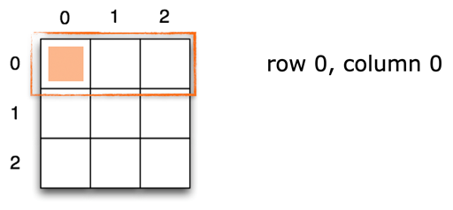
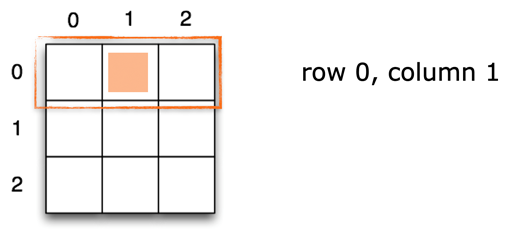
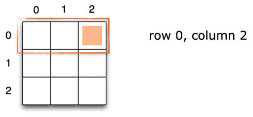
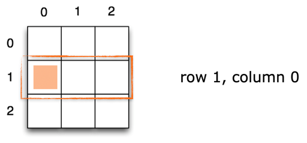
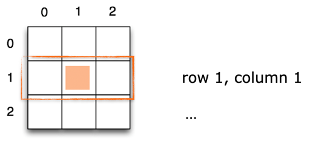
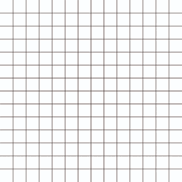
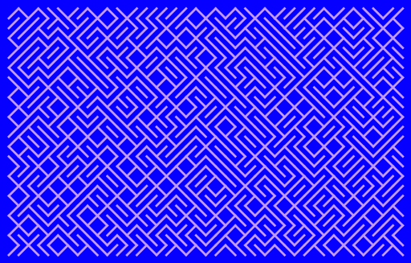

name: inverse
layout: true
class: center, middle, inverse
---

### Code as Material
## Creative Coding Foundations for Artistic and Design Practices

#### - Loops -

<br />
### Prof. Dr. Lena Gieseke | l.gieseke@filmuniversitaet.de  

#### Film University Babelsberg KONRAD WOLF

<br />
.center[]


---
layout:false


.left-even[]
.right-even[]


.center[]

--

.center[*What was the underlying algorithm again?*]

---
layout:false

## The `10 PRINT` Pattern


Algorithm
  
* Go row by row
* Place a `/` or a `\` randomly


---


The original BASIC program for the Commodore 64:

```bash
10 PRINT CHR$(205.5+RND(1)); : GOTO 10
```
<!-- ??? BASIC had its own character indices (not ASCII) -->

--

Bash:

```bash
f="╱╲";while :;do print -n ${f[(RANDOM % 2) + 1]};done
```


???


* BASIC program from the 1980s
* Considered a phenomenon of creative coding through its simplicity and visual appeal
* There is a whole [book](http://10print.org/) dedicated to this line of code
* You can watch the author talk about his work on [youtube](https://www.youtube.com/watch?v=34CXQr5OLas)


* As we are repeatedly placing a `/` or a `\` we need to learn how to repeat code for creating such a pattern. And that is coincidentally what you are going to learn in this script 😁.


---


## Learning Objectives

With this chapter you 

* understand how to repeat code,
* know how to implement a `while` and a `for`-loop, 
* know how to implement a 2D `for`-loop, and
* understand how to create grid-based pattern.


---

## Looping

For repeating the same code multiple times, there are two types of loops,  

* `while-` loops 
* `for-`loops


---

## `while`-Loop

--

```js
// Pseudo code

while (condition is true) {

    //code to repeat
}
```

--


* Closely related to the if-statement

--
* Executed **as long as** (*while*) the condition is true


---

## `while`-Loop

```js
// https://editor.p5js.org/legie/sketches/swLARHfUn
// While Loop

let counter = 0;    // Iteration counter

while (counter < 3) { // Loop condition
  
    print('wow');     // Loop activity

    counter += 1;       // Increase counter
}

print('All done…');
```


???
* https://editor.p5js.org/legie/sketches/IpQYBo_YUU
* 

---

## `while`-Loop

.center[.imgref[[[michaelkipp]](http://michaelkipp.de/processing/07%20schleifen.html)]]

---

## `while`-Loop

```js
// https://editor.p5js.org/legie/sketches/P9nGLtSJq
...

function draw() {

    let counter = 0; // Iteration counter

    while (counter < 30) { // Loop condition
    
        circle(mouseX + random(100), mouseY + random(100), 10);
        counter += 1; // Increase counter
    }
}
```

What is exactly happening here? What is repeated when?

---

## `while`-Loop

* The `draw()` function is called by default 60 times per second.
* For each `draw()` call, we execute the loop, hence we draw 30 ellipses 60 times per second.

???

  

* Even though the while-loop works just fine with setting up a counter and increasing it manually, it is there is another way of creating loops which gives us more control and is less error prone.
* Before we have a look into `for`-loops, let's review the general loop logic.
* https://www.geeksforgeeks.org/find-if-a-point-lies-inside-or-on-circle/
* https://stackoverflow.com/questions/481144/equation-for-testing-if-a-point-is-inside-a-circle


### Quick Detour

## Test If A Point Is Inside A Circle

## Test If A Point Is Inside A Circle

.left-even[.imgref[[[wiki]](https://www.wikiwand.com/en/Circle)]]


.right-even[
A circle with the

* centre coordinates $(a, b)$
* radius $r$

is the set of all points $(x, y)$ such that

$(x-a)^2 + (y-b)^2 = r^2$

]


## Test If A Point Is Inside A Circle

To test if a point is *inside* a circle we have to test for

<br />

$(x-centerX)^2 + (y-centerY)^2 <= r^2$


```js
// https://editor.p5js.org/legie/sketches/q53DdC1ul

if ((x - centerX) * (x - centerX) +
    (y - centerY) * (y - centerY) <= r * r) {

        // Points are inside
    }
```


???

* https://editor.p5js.org/legie/sketches/q53DdC1ul


---

## `while`-Loop

# 🚨 
**You have to make sure that the condition becomes `false` at some point!**
  
--
  
Otherwise you have created an **infinity loop** 🤬 ♾️


---
template:inverse

# Loop Logic

---
## Loop Logic

Independently from the specific syntax both loops follow the same logic and include the same components.

--

For repeating code you need to

--
* Create a variable (e.g. `i`) as iterator
    * Initialize the iterator with a start value
--
* Give a termination condition

--
* Increase the iterator in each loop

--
* Check for the termination condition


???

The last two points can also happen in reversed order (hence, first check the termination condition and then increase the iterator).


---


## Loop Logic

`while`-loop:

```js
let counter = 0;    // INITIALIZATION
while (counter < 3) { // CONDITION
    // code
    counter += 1;   // STEP
}
```

--

`for`-loop:

```js
// Pseudo Code

for(INITIALIZATION; CONDITION; STEP) {
    // code
}
```

???

* The `for`-loop also executes a block of code the given number of times. It is used more often than the while loop because it gives you more control.

---


## Loop Logic


```js
// Pseudo Code

for(INITIALIZATION; CONDITION; STEP) {
    // code
}
```

```js
for(let i = 0; i < numberOfTimes; i++) {

    // code

}
```


???

  

* You can chose any variable name as iterator
    * `i` as short for iterator is just typical
* You can chose any start value
    * Most times it will be `0` though
* You can chose any end value `numberOfTimes`
    * This can be a direct value or a variable
* `i++` is a shortcut for `i=i+1` and represents the step size, meaning how the value of the iterator changes from iteration to iteration
    * You can chose any step size you want, e.g. `i+=12`

---

## For Loop

```js
let counter = 0;
while (counter < 3) {
 
    print('wow');
    counter += 1;
}
```

--

```js
// https://editor.p5js.org/legie/sketches/QcpJQ9fMR
// For Loop

for(let i = 0; i < 3; i++){
    print('wow');
}
```

---

## For Loop

Or with a different variable name:

```js
for(let counter = 0; counter < 3; counter++){
    print(“wow”);
}
```

---

## For Loop

The for loop follows the same logic as the while loop:

.center[.imgref[[[michaelkipp]](http://michaelkipp.de/processing/07%20schleifen.html)]]


---

## For Loop


```js
// https://editor.p5js.org/legie/sketches/9kusxGMGp
// The For-Loop Inside Draw

...

function draw() {
    // let counter = 0; // Iteration counter
    // while (counter < 30) { // Loop condition 
    //     ellipse(mouseX + random(30), mouseY + random(30), 2, 2);
    //     counter += 1; // Increase counter
    // }

    for (let i = 0; i < 30; i++) {
        ellipse(mouseX + random(30), mouseY + random(30), 2, 2);
    }
}

```

---

## For Loop

What is the scope of the iteration variable?  

--

The scope is **local** within the loop code block, meaning it is only visible inside the loop:

```js
// Pseudo Code

for(let i = 0; i < numberOfTimes; i++) {

    // i only exists here

}
print(i); //gives an error
```

---

## For Loop

*How to create something like the following?*

.center[]

---
template:inverse

# 2D Loops

---

## 2D Loops

???

In the following, we are not learning any new syntax but only apply what we have learned above.

--

As we are working on a 2D canvas in x and y, often times a 2D loop is used to fill a space, for example the canvas. You can imagine this as the filling of a grid.

<br />
.center[]


---

## 2D Loops

**For every row, look at every element…**

--

  


---

## 2D Loops

**For every row, look at every element…**

  

---

## 2D Loops

**For every row, look at every element…**

  

---

## 2D Loops

**For every row, look at every element…**

  

---

## 2D Loops

**For every row, look at every element…**

  

---

## 2D Loops

For implementing this, we **nest** two loop as follows

```js
// Pseudo Code

For every row {
    For every column {

    }
}
```
---

## 2D Loops

```js
// https://editor.p5js.org/legie/sketches/lpStDBNUC
// 2D For-Loop

// Nested loop to run through the grid
for (let gridY = 0; gridY < numberRows; gridY++) {

    for (let gridX = 0; gridX < numberColumns; gridX++) {

        print("Row: " + gridY + " Column: " + gridX);
    
    }
}
```

???
https://editor.p5js.org/legie/sketches/uO_y3MUZQ

* But as said before, you normally used shorter names. The following is the same as this above but with different variable names. If the variables refer to x,y coordinate, you often also use x and y as iterator variable names:

---
.header[2D Loops]

## A Grid

Now, we can, for example, use `rect` within the 2D loop to create a grid:

--

<br />
.center[]


---
.header[2D Loops]

## A Grid

<script type="text/p5" data-p5-version="1.6.0" data-autoplay data-height="450" data-preview-width="500" >
let rectSize = 50;

function setup() {
    createCanvas(windowWidth, windowHeight);
    background(255);

    noLoop();
}

function draw() {

    // Nested loop to run through the grid
    for (let y = 0; y < windowHeight; y++) {
        for (let x = 0; x < windowWidth; x++) {
        
            rect(x, y, rectSize, rectSize);
        
        }
    }
}
</script>


???
  

* We need to take larger steps to draw fewer rectangles. We can create a nice continuos grid, when taking the size of the rectangle also as the step size.

---
.header[2D Loops]

## A Grid

<script type="text/p5" data-p5-version="1.6.0" data-autoplay data-height="450" data-preview-width="500" >
let rectSize = 50;

function setup() {
    createCanvas(windowWidth, windowHeight);
    background(255);

    noLoop();
}

function draw() {

    // Nested loop to run over
    // all pixels of the canvas
    // We are using the rectSize variable
    // to control the step size of the
    // loop
    for (let y = 0; y < windowHeight; y+=rectSize) {
        for (let x = 0; x < windowWidth; x+=rectSize) {


            rect(x, y, rectSize, rectSize);


        }
    }
}
</script>


???
  

* Now, we can for example also draw ellipses along the grid.


---
.header[2D Loops]

## A Grid

<script type="text/p5" data-p5-version="1.6.0" data-autoplay data-height="450" data-preview-width="500" >
let rectSize = 50;

function setup() {
    createCanvas(windowWidth, windowHeight);
    background(255);

    noLoop();
    noFill();
}

function draw() {

    // Nested loop to run over
    // all pixels of the canvas
    // We are using the rectSize variable
    // to control the step size of the
    // loop
    for (let y = 0; y < windowHeight; y+=rectSize) {
        for (let x = 0; x < windowWidth; x+=rectSize) {

            rect(x, y, rectSize, rectSize);
            ellipse(x, y, rectSize, rectSize);
        }
    }
}

</script>


???
  

* Why is there this strange offset around the border?
* Because we are drawing the ellipses at the left upper corner (0,0) of each cell.
* For that we add to the above example rectangle with `stepSize` as size to visualize the grid structure we are working with:

---
.header[2D Loops]

## A Grid

<script type="text/p5" data-p5-version="1.6.0" data-autoplay data-height="450" data-preview-width="500" >
let rectSize = 50;

function setup() {
    createCanvas(windowWidth, windowHeight);
    background(255);

    noLoop();
    noFill();
}

function draw() {

    // Nested loop to run over
    // all pixels of the canvas
    // We are using the rectSize variable
    // to control the step size of the
    // loop
    for (let y = 0; y < windowHeight; y+=rectSize) {
        for (let x = 0; x < windowWidth; x+=rectSize) {

            rect(x, y, rectSize, rectSize);
            ellipse(x + rectSize * 0.5, y + rectSize*0.5, rectSize, rectSize);
        }
    }
}

</script>


???
  

* Shifting the drawing of the ellipse to the center of the grid cell.

---
.header[2D Loops]

## A Grid

<script type="text/p5" data-p5-version="1.6.0" data-autoplay data-height="450" data-preview-width="500" >
let rectSize = 50;

function setup() {
    createCanvas(windowWidth, windowHeight);
    background(255);

    noLoop();
    noFill();
}

function draw() {

    // Nested loop to run over
    // all pixels of the canvas
    // We are using the rectSize variable
    // to control the step size of the
    // loop
    
    
    
    for (let y = 0; y < windowHeight; y += rectSize) {

        for (let x = 0; x < windowWidth; x += rectSize) {

            // My smiley
            strokeWeight(1);
            fill(255, 180, 225);

            ellipse(x + rectSize * 0.5, y + rectSize * 0.5, rectSize);

            noFill();
            arc(x + 18, y + rectSize * 0.45, 10, 20, radians(180), radians(360));

            arc(x + rectSize * 0.5 + 8, y + rectSize * 0.45, 10, 20, radians(180), radians(360));

            arc(x + 25, y + rectSize * 0.6, 30, 20, 0, radians(180));

        } // END for (let x...

    } // END for (let y...

} // DRAW

</script>

???
Start: https://editor.p5js.org/legie/sketches/0lByVe-mH

Show, making it into a loop
* add let rectSize = 50;
* make smiley repeat (the head)...

End: https://editor.p5js.org/legie/sketches/fX_uZSsLo

```
function draw() {
  //rect(50, 50, 400, 400);

  fill(255, 255, 0);
  

  for (let y = 0; y < windowHeight; y += rectSize) {
    for (let x = 0; x < windowWidth; x += rectSize) {
      
      circle(x + rectSize*0.5, y+ rectSize*0.5, 40);
      
      // Angry
      if (!mouseIsPressed) {
        //Eyes
        line(x + 15, y + 18, x + 22, y + 25);
        line(x + 38, y + 18, x + 31, y + 25);

        // Mouth
        arc(x + 25, y + 40, 30, 20, radians(200), radians(340));

        // Happy
      } else {
        //Eyes
        arc(x + 20, y + 25, 5, 8, radians(180), radians(360));
        arc(x + 30, y + 25, 5, 8, radians(180), radians(360));

        // Mouth
        arc(x + 25, y + 28, 30, 20, 0, radians(180));
      }
    }
  }
}
```


---
.header[2D Loops]

## A Grid

<script type="text/p5" data-p5-version="1.6.0" data-autoplay data-height="450" data-preview-width="500" >
let rectSize = 50;

function setup() {
    createCanvas(windowWidth, windowHeight);
    background(255);

    // For interaction don't forget
    // to turn on the loop again!
    //noLoop();
    noFill();
    stroke(180, 0, 255);
    strokeWeight(2);
}

function draw() {
    
    // Clearing the background in each
    // draw call
    background(255);

    
    
    // Mapping the value range mouseX, and mouseY
    // to be between 5..250 with the map function
    // https://p5js.org/reference/#/p5/map
    let diameterX = map(mouseX, 0, windowWidth, 5, 250);
    let diameterY = map(mouseY, 0, windowHeight, 5, 250);


    // Nested loop to run over
    // all pixels of the canvas
    // We are using the rectSize variable
    // to control the step size of the
    // loop
    for (let y = 0; y < height; y+=rectSize) {
        for (let x = 0; x < width; x+=rectSize) {

            // rect(x, y, rectSize, rectSize);
            ellipse(x + rectSize*0.5, y + rectSize*0.5, diameterX, diameterY);
        }
    }
}
</script>


???
  

DO THIS WITH ALL
* For making the pattern more interesting, we  control the width and height of the ellipses with mouseX and mouseY. 
* For that we need to map the possible value range of 0..1000 that mouseX and mouseY can have to a smaller range, e.g., 5..500 for having a reasonable sizes for the ellipse

---
.header[2D Loops | Grids]

## Interactive Circles

--

* Create a grid

--

* Draw one ellipse in each grid cell

--

* Change the ellipse's width and height based on `mouseX` and `mouseY`

---
.header[2D Loops | Grids | Interactive Circles | **1. Create a grid**]

--


```js
function setup() {
  createCanvas(400, 400);

  noFill();
}

function draw() {
  background(255);
}
```

---
.header[2D Loops | Grids | Interactive Circles | **1. Create a grid - First for-loop**]

--

```js
let rectSize = 50;

...

function draw() {
    background(255);

    for (let y = 0; y < height; y+=rectSize) {

    }
  
}
```

---
.header[2D Loops | Grids | Interactive Circles | **1. Create a grid - Second for-loop**]

--

```js
let rectSize = 50;

...

function draw() {
    background(255);

    for (let y = 0; y < height; y+=rectSize) {
        for (let x = 0; x < width; x+=rectSize) {
            rect(x, y, rectSize, rectSize);
        }
    }
  
}
```

---
.header[2D Loops | Grids | Interactive Circles | **2. Draw one ellipse in each grid cell**]

```js
let rectSize = 50;

...

function draw() {
    background(255);

    for (let y = 0; y < height; y+=rectSize) {
        for (let x = 0; x < width; x+=rectSize) {

            ellipse(x + rectSize*0.5, y + rectSize*0.5, 30, 30);
        }
    }
  
}
```

---
.header[2D Loops | Grids | Interactive Circles | **Change the ellipse's width and height based on `mouseX` and `mouseY`**]

```js
let rectSize = 50;

...

function draw() {
    background(255);

    for (let y = 0; y < height; y+=rectSize) {
        for (let x = 0; x < width; x+=rectSize) {

            ellipse(x + rectSize*0.5, y + rectSize*0.5, mouseX, mouseY);
        }
    }
  
}
```

---
.header[2D Loops | Grids | Interactive Circles | **Mapping Values**]

--

```js
let rectSize = 50;

let diameterX = 10;
let diameterY = 10;

...

function draw() {
    background(255);

    for (let y = 0; y < height; y+=rectSize) {
        for (let x = 0; x < width; x+=rectSize) {

            ellipse(x + rectSize*0.5, y + rectSize*0.5, diameterX, diameterY);
        }
    }
  
}
```

---
.header[2D Loops | Grids | Interactive Circles | **Mapping Values**]

<br />

* [`map()`](https://p5js.org/reference/p5/map/)
* Re-maps a number from one range to another.

--

<br />

* We want to map the range the mouse can have (0..400) to a smaller range, e.g. 5..250

???

    // Mapping the value range mouseX, and mouseY
    // to be between 5..250 with the map function
    // https://p5js.org/reference/p5/map/
    let diameterX = map(mouseX, 0, windowWidth, 5, 250);
    let diameterY = map(mouseY, 0, windowHeight, 5, 250);


---
.header[2D Loops | Grids | Interactive Circles | **Mapping Values**]

--

```js
...

function draw() {
    background(255);

    let diameterX = map(mouseX, 0, windowWidth, 5, 250);
    let diameterY = map(mouseY, 0, windowHeight, 5, 250);


    for (let y = 0; y < height; y+=rectSize) {
        for (let x = 0; x < width; x+=rectSize) {

            ellipse(x + rectSize*0.5, y + rectSize*0.5, diameterX, diameterY);
        }
    }
  
}
```


---


## The 10 PRINT Example

Now we know how to implement the 10 PRINT example!

  
[[10print.org]](https://10print.org/)

---

## The 10 PRINT Example

--

We need to place randomly either a slash or backslash in each cell of our grid.  

--

In order to have a simple 50-50 decision maker, you can use the following:

```js
let probability = 0.5;

if (random(1) < probability) {

    //...
}
else {
    //...
}
```


???
  

* Can someone explain how this works?

---

## The 10 PRINT Example

We need to place randomly either a slash or backslash in each cell of our grid.  

In order to have a simple 50-50 decision maker, you can use the following:

```js
let probability = 0.5;

if (random(1) < probability) { //all random numbers between 0..0.49

    //...
}
else { //all random numbers between 0.5..0.99

    //...
}
```

---

## The 10 PRINT Example

<script type="text/p5" data-p5-version="1.6.0" data-autoplay data-height="450" data-preview-width="500" >
//https://editor.p5js.org/legie/sketches/Gd7jHe9WZ

let cellSize = 10;

// Threshold for which
// slash to draw
let probability = 0.5;


function setup() {
	createCanvas(1000, 1000);
	background(255);

	noLoop();
}

function draw() {

	// Nested loop to run over
	// all pixels of the canvas
	// We are using the rectSize variable
	// to control the step size of the
	// loop
	for (let y = 0; y < height; y += cellSize) {
		for (let x = 0; x < width; x += cellSize) {


			// Switch which "character" to draw
			// based on probability
			if (random(1) < probability) {

				line(x, y, x + cellSize, y + cellSize);

			} else {

				line(x, y + cellSize, x + cellSize, y);

			}
		}
	}
}
</script>


???
TASK:
* https://editor.p5js.org/legie/sketches/nrfQTzxMI
* https://editor.p5js.org/legie/sketches/fYvij_ACr


---
template:inverse

## Summary

---
## Summary

### Loops

```js
while(i < numberOfTimes)…
```

```js
for(int i = 0; i < numberOfTimes; i++)…
```

---
## Summary

### 2D Loop

*For every row look at every element…*

```js
for (let y = 0; y < numberRows; y++) {
    
    for (let x = 0; x < numberColumns; x++) {

        print("Row: " + y + " Column: " + x);
    }
}
```

--

Use the [reference](https://p5js.org/reference/) 🚒


---
template:inverse 

# *The End*


### Prof. Dr. Lena Gieseke | l.gieseke@filmuniversitaet.de  

#### Film University Babelsberg KONRAD WOLF
