name: inverse
layout: true
class: center, middle, inverse
---

### Code as Material
## Creative Coding Foundations for Artistic and Design Practices

#### - Creative Coding & Algorithmic Thinking -

<br />
### Prof. Dr. Lena Gieseke | l.gieseke@filmuniversitaet.de  

#### Film University Babelsberg KONRAD WOLF

<br />
.center[]


---
template:inverse

## *How do you define creativity?*


---
template:inverse

## *How are you creative?*

???

* You can create anything out of nothing
* Freedom of choice for a solution, many options
    * A bit like lego…
* Results are easily shared
* (Collaborative)


---
template: inverse

## *Creative Coding?*


---
layout: false

.center[[](https://owncloud.gwdg.de/index.php/s/ZtWMVcHEpmrknE3)]
    
.footnote[[Chris Milk. 2012. [*The Johnny Cash Project*](https://www.radicalmedia.com/work/the-johnny-cash-project/). Radical Media]]


???

* Animation spiegelt das Thema des Liedes über Sterblichkeit, Wiedergeburt und das ewige Leben.
* Was Ihr hier gesehen habt ist aber nicht nur eine Animation. 
* Es ist ein kollaboratives Projekt an dem bis heute über 250000 Menschen aus 172 Ländern teilgenommen haben.
*  Es ist ein online Projekt mit dem jeder einen einzelnen Frame des originalen Video interpretieren kann.
*  Darüber hinaus kann man auf der Webseite sich alle Frames einzeln anschauen, verschieden Konfigurationen des Video ansehen, Frames werden zum Bespiel nach Stil getackt. 
*  Des weiteren nimmt die Webseite den Prozess des Malens auf, so dass man sich hinterher anschauen kann, wie die einzelnen zu Ihrem Endergebnis gekommen sind.
*  Dazu hier ein Video in dem der Erschaffer der Seite, Medienkünstler Aaron Koblin, der die Benutzung der Webseite kurz erklärt…
  


---

.center[[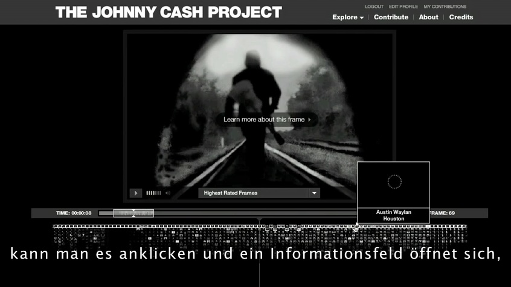](https://owncloud.gwdg.de/index.php/s/IVvTrSu2GL4gTvX)]
    
.footnote[[Chris Milk. 2012. [*The Johnny Cash Project*](https://www.radicalmedia.com/work/the-johnny-cash-project/). Radical Media]]


???

* Und durch diese mögliche Interaktion mit der Webseite, wird die Animation zu einer dynamischen sich kontinuierlich entwickelnden Datenbank an möglichen Outputs und die Website zu einem erzählenden und Menschen verbindenden Medium.
* Dazu hier noch mal ein kurzes Video, in dem Teilnehmer ihre Erfahrung kommentieren.

---
.center[[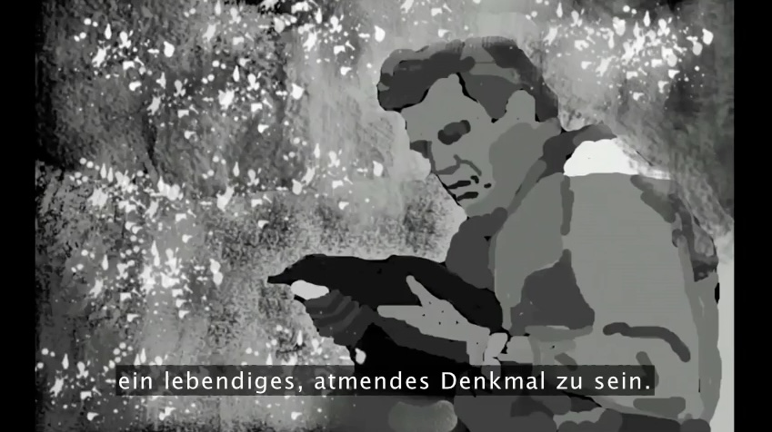](https://owncloud.gwdg.de/index.php/s/LYx9pV3hPcUzChu)]
    
.footnote[[Chris Milk. 2012. [*The Johnny Cash Project*](https://www.radicalmedia.com/work/the-johnny-cash-project/). Radical Media]]


???

* Schlüsselaussage: die Webseite, also die Application erzeugt “A living, breathing memorial” an dem wir alle teilhaben können.
* Dieses Projekt zeigt wie durch den durchdachten und kreativen Einsatz von Technik, die Technik selbst eine ganz besondere Bedeutung bekommt und wie in diesem Fall nicht nur eine interessante Animation produziert sondern eine tiefergehende und gemeinschaftliche Erfahrung für den User oder das Publikum geschaffen wird.


---
## Creative Coding

???

* There are actually no fixed definitions of what *creative coding* means. 
* Within CTech we understand creative coding as:

--

* Producing something expressive rather practical

--

* Software beyond its standard usage scenarios

--
* Tools that help others to be creative

???


The last aspect of developing tools is somewhat detached and not necessarily part of a common understanding of creative coding. However, to us it is and equally important topic. We would like to integrate tool development into our portfolio with the goal of developing tools beyond the obvious and beyond practicability. When thinking about tool development in the context of web technologies, collaborative work and sharing ideas, content, etc. in the virtual space are exciting directions to go.

---

## Creative Coding


> Aesthetics, insight, joy, dialog, politics, collaboration, augmentation, emotion, perspectives, friendship,...

--

<br />
*How could you explore one of the above mentioned terms with a software project?*


---
## Creative Coding


???
For your creative work, I would like to encourage you to use the following as guidance:

--

> What do I have available and what can I do with that beyond the obvious?
  

--

# ☝🏻


???
* Available also in reference to one own skill set


---

## Creative Coding

--
* Algorithms and generative systems to create graphics and sounds

--
* Smart data sources
    * Images, video, sound
    * Camera and microphone
    * Online resources such as Twitter and Instagram
    * Mobile devices as sensors
    * ...

---
## Creative Coding


* Interesting output formats
    * Web
    * From large-scale such as buildings to small-scale such as smart watches
    * Multi-screen setups for example with mobile devices
    * ...


???
* We read, experience, share and create with the potential community of all web users. 

> Who are all web users?

* We will focus on web-based programming environments


---
.header[Creative Coding | Examples]

## Paper Planes

[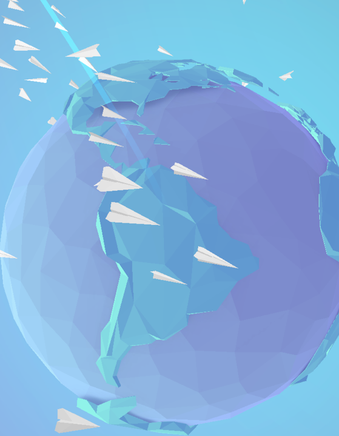  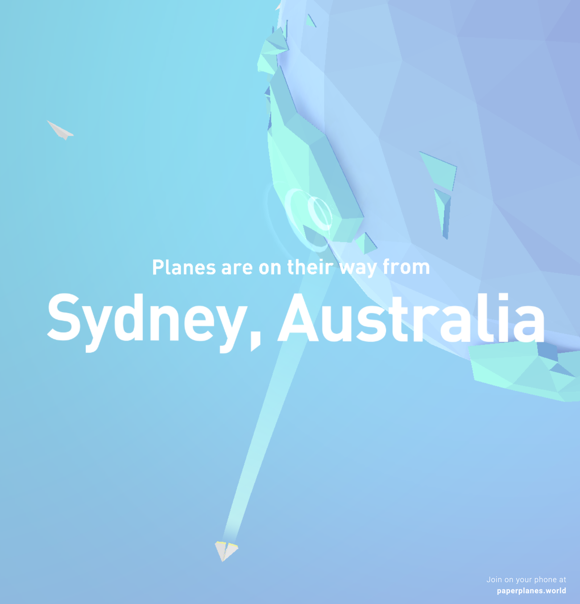](https://paperplanes.world/) [[Paper Planes ⬀]](https://paperplanes.world/)

<!-- [](https://paperplanes.world/)   -->
<!-- [[Paper Planes]](https://paperplanes.world/) -->


<!-- 
[](https://armsglobe.chromeexperiments.com/)  
[[Arms Globe]](https://armsglobe.chromeexperiments.com/)


[](https://deck.gl/showcases/wind/)  
[[deck.gl]](https://deck.gl/showcases/wind/)


[](https://lines.chromeexperiments.com/) [[Land Lines]](https://lines.chromeexperiments.com/)

* The website of Zach Lieberman lets you explore Google maps satellite images through gestures. With the draw option, you can find similar satellite images that match the line that you draw on the screen. With the drag option, you can draw an infinite landscape based on your mouse movement.

-->

---
.header[Creative Coding | Examples]

## Unnumbered Sparks

[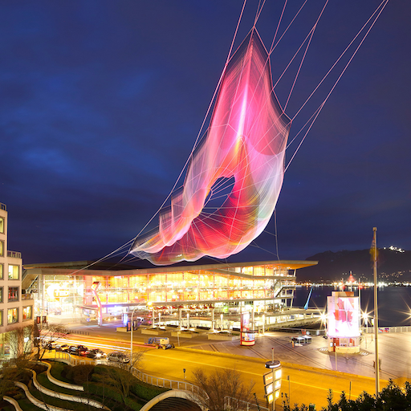](https://www.youtube.com/watch?v=npjTmG-TBHQ&feature=emb_logo) [[Unnumbered Sparks ⬀]](http://www.aaronkoblin.com/project/unnumbered-sparks/)


---
.header[Creative Coding | Examples]

## Cinemetrics

[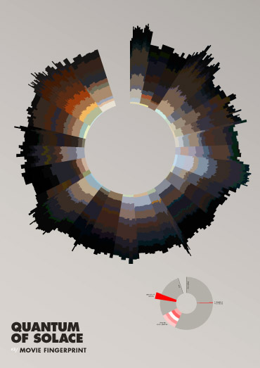](https://cinemetrics.site/) [[Cinemetrics ⬀]](https://cinemetrics.site/)


???

.task[TASK:]  

* stop 1:25


* What type of tools are possible through the web?

---
.header[Creative Coding | Examples]

## Everyday Software

[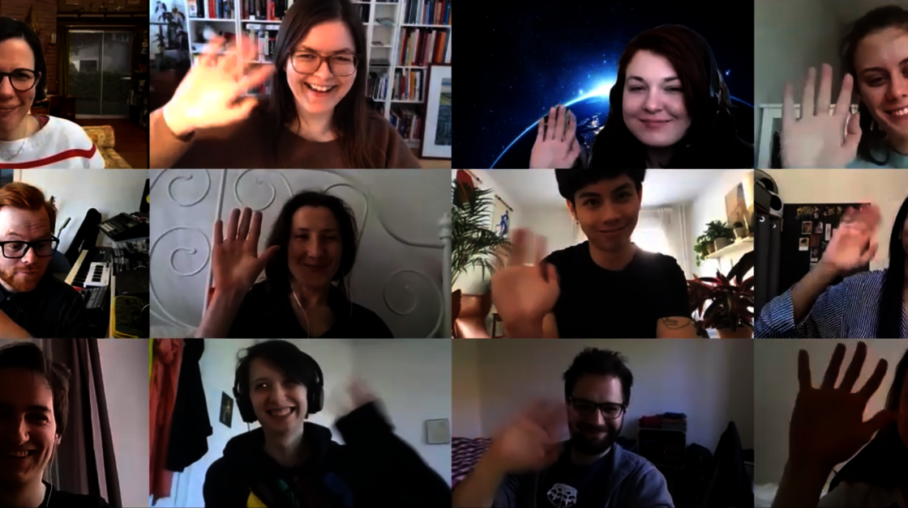](https://miro.com/)
[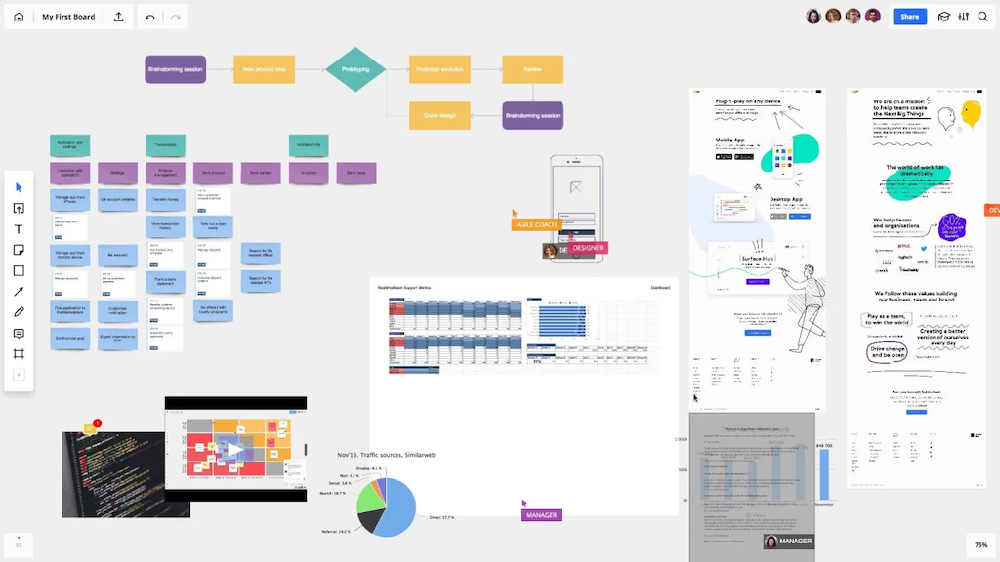](https://miro.com/)

--


> How to make this system more fun or more interesting? 

???

Any ideas?
  

---
.header[Creative Coding | Examples]

## Live Coding

.left-even[
[Hydra](https://hydra.ojack.xyz/docs/#/)

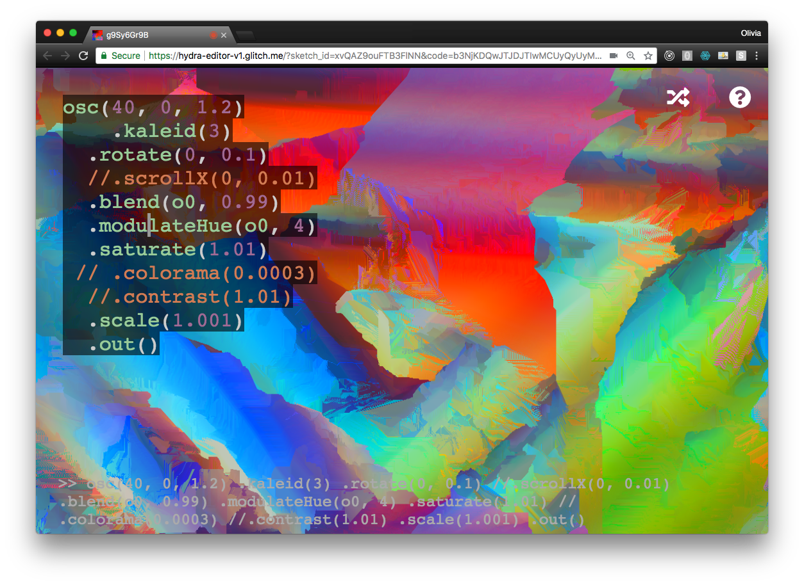
]
.right-even[
* For audivisual performances
* Open-source
* All-levels
]

???

For example with [Hydra](https://hydra.ojack.xyz/docs/#/) you can live code in the browser for audiovisual performances. It is free and open-source and made for beginners and experts alike.


* https://hydra.ojack.xyz/?sketch_id=ritchse_3
* https://hydra.ojack.xyz/docs/#/
* https://cdm.link/2019/02/hydra-olivia-jack/


---

## Creative Coding

<br/>

> What do we have available and what can we do with it beyond the obvious?

???

---
template:inverse

# Coding

---

.header[Creative Coding]

## Become a Better You 😀


Practice a systematic approach to problem solving

--

* …reflect and come up with a plan
* …divide and conquer
* …start with what you know
* …reformulate
* …build a healthy frustration tolerance and trust the process

--

<br />
In combination with
* Using your intuition and sensibilities, experiment!


---


.header[Creative Coding]

## Become a Better You 😀

.left-even[
* You are learning a completely new skill
* You don’t know your approach yet
]

.right-even[ .imgref[[tattly](https://tattly.com/products/love-yourself)]]

---


.header[Creative Coding]

## But I Hate Maths… 😳

* Programming in itself has nothing to do with maths  
    * Many programmers never use any maths at all
    * Certain applications might need maths, such as graphics and sound

--

* Programming is more like Sudoku
    * Solving one step at a time
    * Each step give hints for the next one

--

* Divide a problem into manageable sub-steps


---
.header[Creative Coding]

## Like Writing a Recipe


???

1. Write a recipe from scratch
2. Start with another recipe as basis
3. Use a can

* What is Programming?
* To Command!

* Give commands to the computer
    * *Do this, then do that…*
    * *If this is true, do this; otherwise do that…*
    * *Do this 10 times…*
    * *Do this as long as…*


---
.header[Creative Coding]

## Syntax

* The syntax of a programming language is the formal set of rules that defines how symbols, keywords, and structures must be arranged to form valid instructions that a computer can interpret.

--

```js
for (let i = 0; i <= 100; i++) {

    circle(i, i, 10);
}

```

---
.header[Creative Coding]

## Syntax

.center[  .imgref[[[wiki]](https://de.wikipedia.org/wiki/Liste_von_Hallo-Welt-Programmen/Höhere_Programmiersprachen#Java)]]


.header[What Are Programming Languages? | Algorithms]

## Hello World 👋🏻

### But Why?

* Tradition
* First used by Brian Kernighan, 1974 in the Bell Laboratories
* http://helloworldcollection.de
    * 567 Hello World programs

???


[[wikipedia]](https://de.wikipedia.org/wiki/Liste_von_Hallo-Welt-Programmen/H%C3%B6here_Programmiersprachen)

???


---
.header[Creative Coding]

## Algorithm

???
*[…] an algorithm is a set of instructions, **typically to solve a class of problems** or perform a computation.*

<br />

*Algorithms are **unambiguous** specifications for performing calculation, data processing, automated reasoning, and other tasks.*

--

*Give instructions for cleaning the dishes.*

--
.left-even[
* With what are we working?
    * Inputs, data
* What is the process?
]

--
.right-even[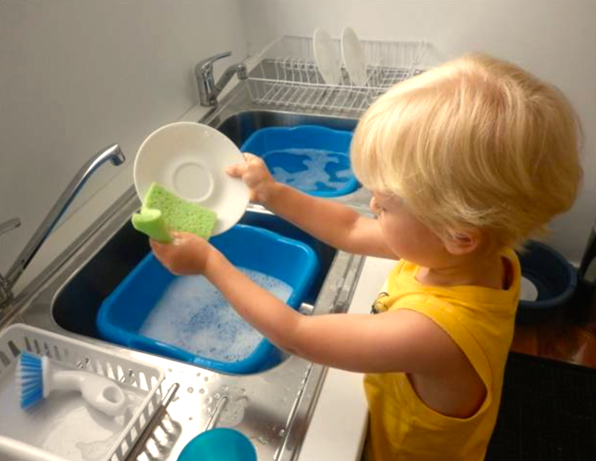  .imgref[[[source]](https://www.montessoriprivateacademy.com/wp-content/uploads/2015/11/montessori-washing-dishes.png)]]


???

* (plate, sponge, water, tap, soap, dirt)


.task[TASK:]  


## Hello World in p5.js?

p5.js is optimized for designer and artists to develop graphics, sound and interaction.


* Input: Program Code
* Output: Graphics


```js

function setup() {
    createCanvas(100, 100);
    background(255);
}

function draw() {
    point(50, 50);
}
```


* Show [Sketch](https://openprocessing.org/sketch/1011532)


[[1]](https://de.wikipedia.org/wiki/Liste_von_Hallo-Welt-Programmen/H%C3%B6here_Programmiersprachen)


---
template:inverse

# Algorithmic Thinking


???
   

* https://editor.p5js.org/legie/sketches/ZMRephHbg

* For a better understanding of the grid structure and also of operators, here a couple of examples.

---

## Algorithmic Thinking Examples

*How can you control the fill command to create the following examples?*

.center[]

---
.header[2D Loops]

```js
// https://editor.p5js.org/legie/sketches/lWJGIhhtI
function draw() {

    // Nested loop to run over all pixels of the canvas
    for (let y = 0; y < canvasSize; y+=stepSize) {
        for (let x = 0; x < canvasSize; x+=stepSize) {


            fill(255);
            // Changing the fill color
            // only for the cells on the
            // diagonal
            if ( y == x) {
                fill(0);
            }

            rect(x, y, stepSize, stepSize);
        }
    }
}
```

---


### Algorithmic Thinking Examples

.center[]

---


```js
// https://editor.p5js.org/legie/sketches/5x1bAs66K

function draw() {

    for (let y = 0; y < canvasSize; y+=stepSize) {
        for (let x = 0; x < canvasSize; x+=stepSize) {

            stroke(0);
            fill(255);

            if (x > y) {
                stroke(255);
                fill(0);
            }

            rect(x, y, stepSize, stepSize);
        }
    }
}
```

---


### Algorithmic Thinking Examples


.center[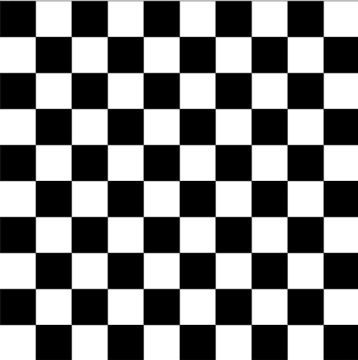]


???
   

* The overall logic to create a checkerboard is to fill every other cell black and to shift that every other row. 

* You could also say that in the even rows (meaning the 0., 2., 4. row...), the even columns (meaning the 0., 2., 4. column...) should be black, and in the uneven rows, the uneven cells should be black.

* You can identify even numbers with the modulo operator.

---
template:inverse

### Syntax

## The Modulo Operator

---


## The Modulo Operator

--

The [modulo](https://www.computerhope.com/jargon/m/modulo.htm) operator returns for a division with a whole number the rest of that division:

```js
// Pseudo Code
 5 / 2 is 2 with rest 1
 8 / 2 is 4 with rest 0
 6 / 3 is 2 with rest 0
30 / 9 is 3 with rest 3
```
--
```
 5 % 2 = 1  
 8 % 2 = 0  
 6 % 3 = 0  
30 % 9 = 3  

```


???

```
5 / 2 is 2 (the quotient) with rest 1  

x / y is quotient q with rest r
x = q * y + r
```

---


## The Modulo Operator

This comes in handy when testing for even numbers:

--

```js
let number = 7;

if (number % 2 == 0) {

    print("even");
}
```


---
```js
// https://editor.p5js.org/legie/sketches/_NHk4arDR
function draw() {

    for (let y = 0; y < canvasSize; y += stepSize) {
        for (let x = 0; x < canvasSize; x += stepSize) {
            fill(255);

            // We need to divide by stepSize
            // to get the indices
            let row = y / stepSize;
            let column = x / stepSize;

            if ( ((row % 2 == 0) && (column % 2 == 0)) ||
                 ((row % 2 != 0) && (column % 2 != 0)) ) {

                    fill(0);
            } 
            rect(x, y, stepSize, stepSize);
        }
    }
}
```


???
* In our example, we can not work directly with the pixel coordinates, as by adding an even `stepSize` for the grid, we only have even pixel coordinates, such as 0, 100, 200,... 
* We need to divide the coordinates by `stepSize` to get the indices of the cells, with which we then want to do the modulo operation. 

???


---

## Algorithmic Thinking


--
The goal is an **algorithm**, 

--
which we understand as defining a list of steps to finish a task.

.footnote[[[code.org]](https://code.org/curriculum/course3/1/Teacher)]

  
--
  
Algorithmic thinking applies:

--
  
* **Decomposition**: Breaking a large problem into smaller, manageable parts to make it easier to solve.

--
* **Pattern Matching**:  Identifying similarities in problems to reuse solutions or processes.

--
* **Abstraction**: Simplifying a problem by focusing on important details and ignoring specifics.


---
.header[Algorithmic Thinking]

## Example

--
> How to play this game?
  
--

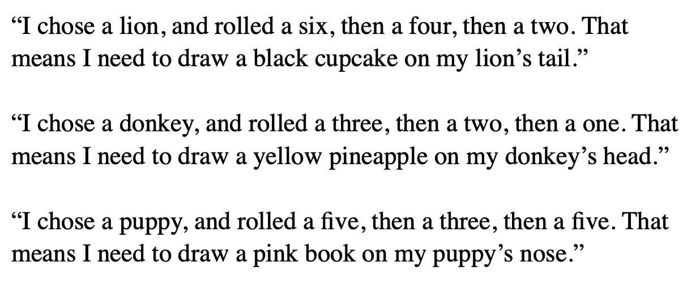


???
  

* Using pattern matching and abstraction!


---
.header[Algorithmic Thinking]

## Example

> Which parts are matching and which differ from player to player? 
  


---
.header[Algorithmic Thinking]

## Example

> Using pattern matching and abstraction!


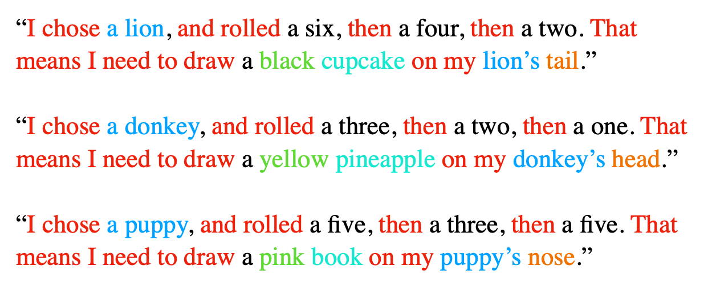


---
.header[Algorithmic Thinking]

## Example


  
Color:
1) Red
2) Blue
3) Yellow
4) Green
5) Pink
6) Black
  
Items:
1) Cell Phone
2) Pineapple
3) Book
4) Cupcake
5) Tentacle
6) Bow
  
Bodypart:
1) Head
2) Tail
3) Foot
4) Belly
5) Nose
6) Back


???
  

Figure out how to play this game by looking at the players’ phrases below. Circle the matching parts and underline words that are different from player to player. The first matching section has been circled for you.

* What kind of cloth do you put on in the morning?


---
.header[Algorithmic Thinking]

## Example

> Sum up all numbers between 1-200. 

---
.header[Algorithmic Thinking | Example]

## Sum Up All Numbers Between 1-200 

**Decomposition**

--

.left-even[
Let's start at the two ends:

* 1 + 200
* 2 + 199
* 3 + 198
* 4 + 197
* ...
]


---
.header[Algorithmic Thinking | Example]

## Sum Up All Numbers Between 1-200 

**Decomposition**


.left-even[
Let's start at the two ends:

* 1 + 200
* 2 + 199
* 3 + 198
* 4 + 197
* ...
  

**Pattern matching:** Each pair results in the sum of 201!
]


  
--
.right-even[
How many of these pairs will we have? 
]

---
.header[Algorithmic Thinking | Example]

## Sum Up All Numbers Between 1-200 

**Decomposition**


.left-even[
Let's start at the two ends:

* 1 + 200
* 2 + 199
* 3 + 198
* 4 + 197
* ...
  

**Pattern matching:** Each pair results in the sum of 201!
]

.right-even[
How many of these pairs will we have? 

* The last pair, we can create is 100 + 101

]

---
.header[Algorithmic Thinking | Example]

## Sum Up All Numbers Between 1-200 

**Decomposition**


.left-even[
Let's start at the two ends:

* 1 + 200
* 2 + 199
* 3 + 198
* 4 + 197
* ...
  

**Pattern matching:** Each pair results in the sum of 201!
]

.right-even[
How many of these pairs will we have? 

* The last pair, we can create is 100 + 101
* We have **100 pairs in total**

]


---
.header[Algorithmic Thinking | Example]

## Sum Up All Numbers Between 1-200 

**Solution**

--
* We have 100 pairs
* Each pair's sum is 201
  
--
  
> **100 * 201 = 20.100**

---
.header[Algorithmic Thinking | Example]

## Sum Up All Numbers Between 1-200 

**100 * 201 = 20.100**
  
--
  
.blockquote[
> How about the sum of all numbers between 1-20.000?  
]
  
--
  
> Or rather between 1-n?

---
.header[Algorithmic Thinking | Example]

## Sum Up All Numbers Between 1-n 

**Abstraction**

--
  
*Solution n=200*:  ** 100 * 201 = 20.100**   

--
*Solution n=20.000*:** 10.000 * 20.001 = 200.010.000**   

--
*Solution n=10*:** 5 * 11 = 55**   
  
  
--
<br >
  
*Solution n*: **(n \* 0.5) \* (n + 1)**  

  
???
  

---
.header[Algorithmic Thinking | Example]

## Sum Up All Numbers Between 1-n 

If you want to practice your algorithmic thinking, have a look at the different [Techniques for Adding the Numbers 1 to 100](https://betterexplained.com/articles/techniques-for-adding-the-numbers-1-to-100/).


???
  

* Which algorithms in the analog world can you think of?
* Cooking, Knitting, Sawing

-> A system of rules to convert information from one form into another one.
R. Eperjesi. 2023. Decode - A friendly introduction to creative coding.

---
template:inverse

### *But we do:*
# Creative Coding

---
## Creative Coding

Combine formal algorithmic thinking with exploration, intuition, ambiguity, the introduction of tensions, etc.


<br />

> Explore creatively the space between precision and imprecision.


---
template:inverse 

# *The End*

### Prof. Dr. Lena Gieseke | l.gieseke@filmuniversitaet.de  

#### Film University Babelsberg KONRAD WOLF

