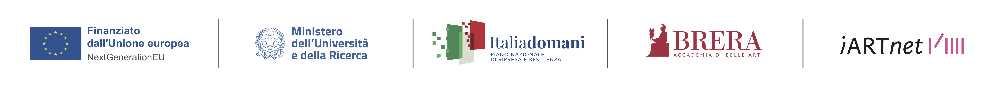
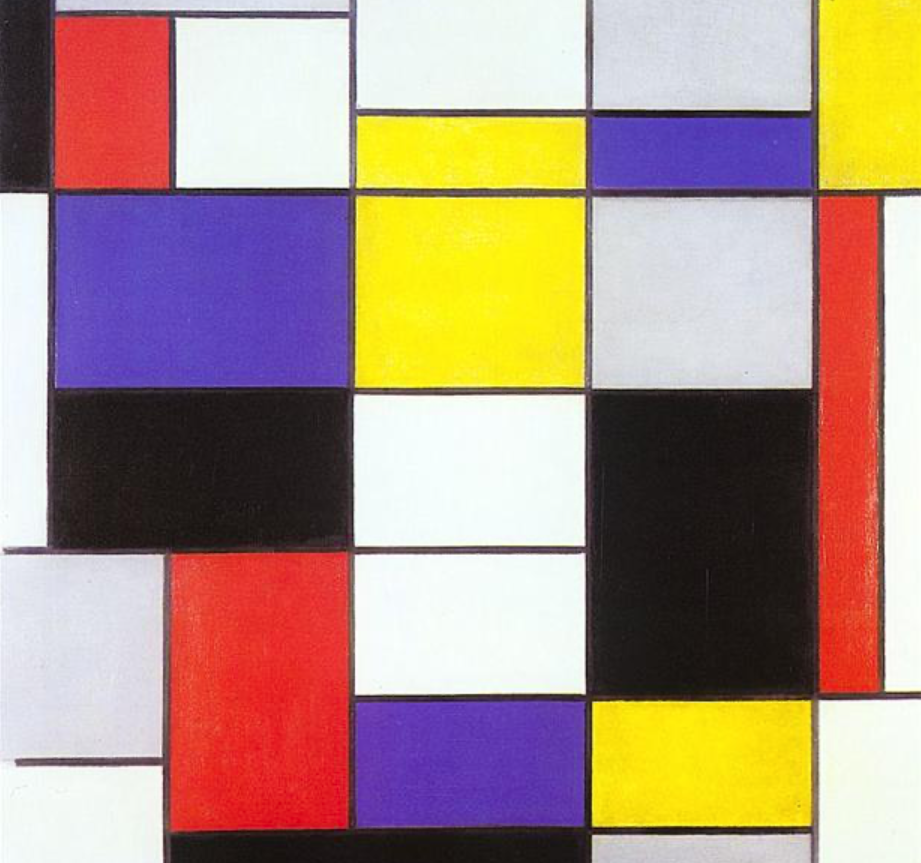
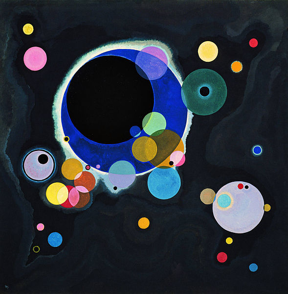
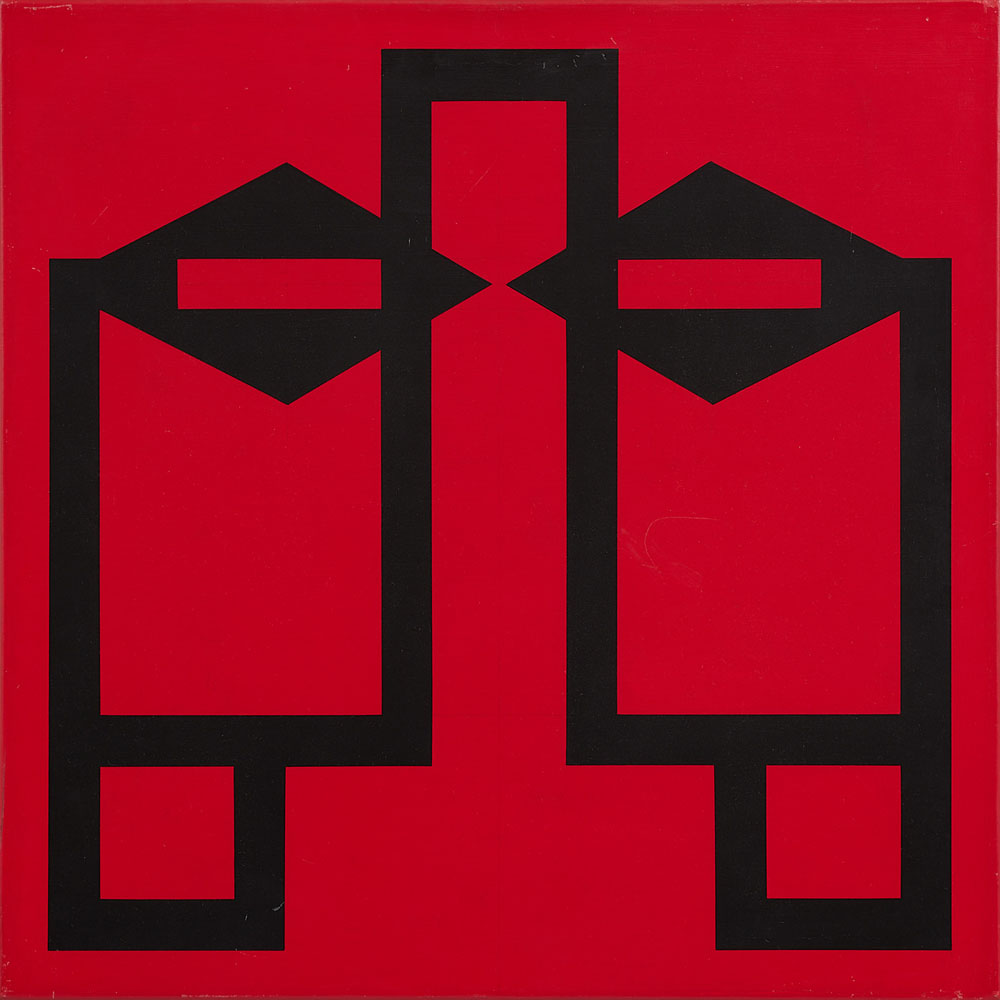
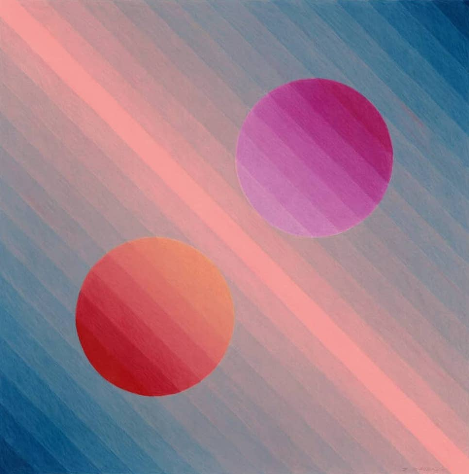
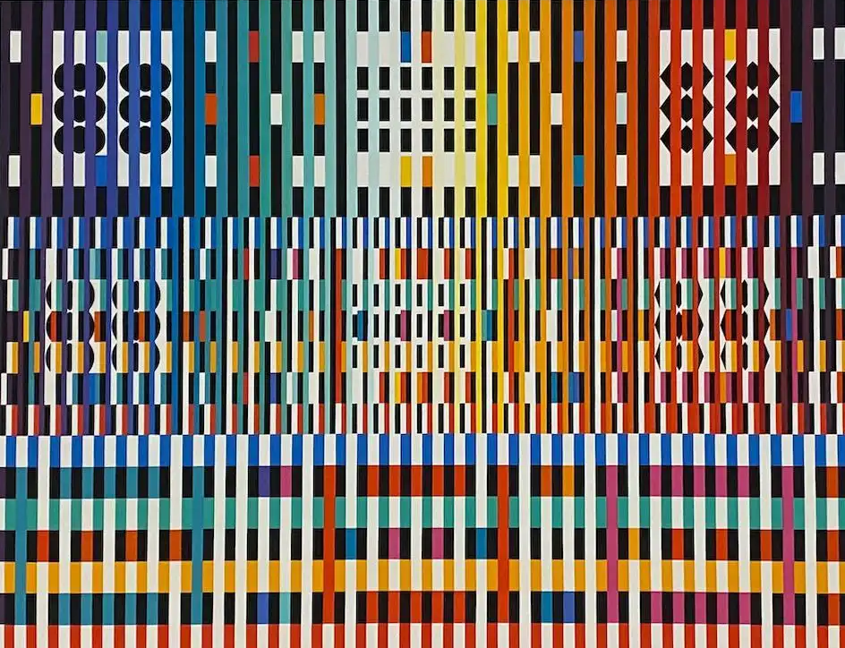
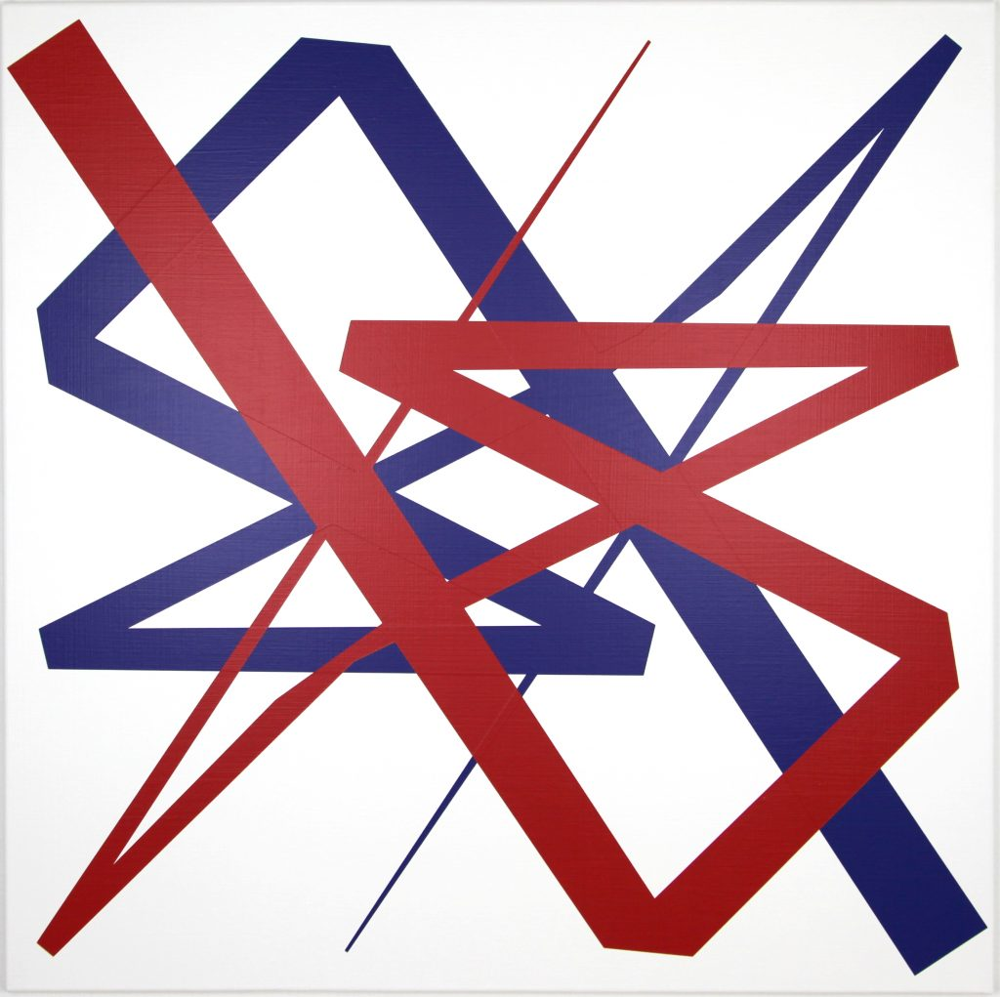

### Workshop
# Code as Material - From Instruction to Expression

  
Prof. Dr. Lena Gieseke \| l.gieseke@filmuniversitaet.de  

---

  
  
## Exercise 01 - Introduction  

### Task 01.01 - Learning Materials

Recap the slides:

* [Slides 01 - Intro](../../01_slides/codeasmaterial_01_intro_slides.html)
* [Slides 02 - Setup](../../01_slides/codeasmaterial_02_setup_slides.html)
* [Slides 03 - Drawing](../../01_slides/codeasmaterial_03_drawing_slides.html)

### Task 01.02 - Setup

Create a account for the [p5.js Editor](https://editor.p5js.org/).

### Task 01.03 - Motivation

Think about it why you want to learn creative coding. What would you like to achieve with it? What could be an interesting project for you? 

### Task 01.04 - Drawing

1. Draw the following house by *combining* shapes. 
2. Draw the same house with `beginShape` and `endShape`.  
  
3. Draw a smiley with simple shapes.   
For this task, you will need to have a look at the reference for drawing an [**arc**](https://p5js.org/reference/p5/arc/).  

4. Draw a creative image with simple shapes. 

#### Inspiration

Your creative image can really be anything.  

In the context of creative coding and putting coding in an artistic context, you could try to think about carefully constructing a [visual design](https://editor.p5js.org/legie/sketches/cikqyBxbd). In my experience the visual quality is seldomly connected to the coding skills. Make use of what you have!

Some inspirations from classical artists:

  
[[Composition A, Piet Mondriaan, 1923]](https://www.wikiart.org/de/piet-mondrian/composition-a-1923) 

  
[[Several Circles, Wassily Kandinsky, 1926]](https://en.wikipedia.org/wiki/File:Vassily_Kandinsky,_1926_-_Several_Circles,_Gugg_0910_25.jpg)

  
[[Hadia geometria 36 – Alphabet 1, Mária Balážová, 1956]](https://www.1stdibs.com/art/prints-works-on-paper/abstract-prints-works-on-paper/yaacov-agam-thanksgiving/id-a_13123922/) 

  
[[ Drawing #220, Zanis Waldheims, 1969]](https://post.moma.org/zanis-waldheims/) 

  
[[Thanksgiving, Yaacov Agam, 1980]](https://www.1stdibs.com/art/prints-works-on-paper/abstract-prints-works-on-paper/yaacov-agam-thanksgiving/id-a_13123922/) 

  
[[Dürer, Pair Impair A, Vera Molnar, 2021]](https://www.apollonia-art-exchanges.com/en/vera-molnar/) 

---

*Happy Starting!*
