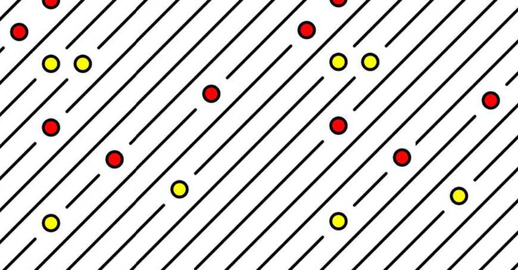

### Workshop
# Code as Material - From Instruction to Expression

  
Prof. Dr. Lena Gieseke \| l.gieseke@filmuniversitaet.de  

---

  
## Exercise 03 - Loops

### Task 03.01 - Line Drawing Algorithm
  
Make at least two adjustments to the [code we worked on in class](https://editor.p5js.org/legie/sketches/9WDwO8l1U) to make it look different. 

Optional, more advanced task: [Refactor the code](https://en.wikipedia.org/wiki/Code_refactoring) to make the code itself more efficient, e.g. by using [vectors](https://p5js.org/reference/p5/p5.Vector/).

## Task 03.02 - A Grid Pattern

Write a sketch that generates a pattern with a similar logic as the 10 PRINT example. You can use the code from the script as basis. Ideally, your pattern should follow an element-by-element and row-by-row iterative creation process - but don't feel limited be this. If you have other ideas for creating a pattern, go for it! The overall goal is to create a visual pleasing or interesting pattern up to your liking.  

Here an example:

*Submission*: Add a link to your sketch in your OwnCloud file.

#### Task 03.03 - Interactive Parameters

Make your pattern interactive by mapping at least one changeable visual characteristics to, e.g., the mouse and / or keys.

---

*Happy Looping!*

