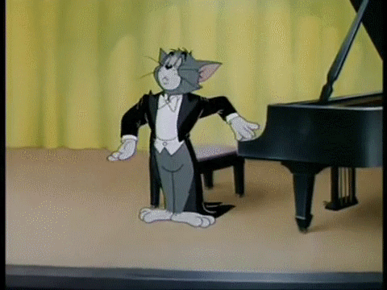

### Workshop
# Code as Material - From Instruction to Expression

  
Prof. Dr. Lena Gieseke \| l.gieseke@filmuniversitaet.de  

---

  
# Exercise 04 - Loops

## Task 04.01 - A Grid Pattern

Write a sketch that generates a pattern with a similar logic as the 10 PRINT example. You can use the code from the script as basis. Ideally, your pattern should follow an element-by-element and row-by-row iterative creation process - but don't feel limited be this. If you have other ideas for creating a pattern, go for it! The overall goal is to create a visual pleasing or interesting pattern up to your liking.  

Here an example:

*Submission*: Add a link to your sketch in your OwnCloud file.

## Task 04.02 - Interactive Parameters

Make your pattern interactive by mapping at least one changeable visual characteristics to, e.g., the mouse and / or keys.

## Task 04.03 - Algorithmic Thinking

Getting dressed is an example of an algorithm. Everyone makes a set of decisions based on for example the weather, where to go that day, day of the week, and their personal style to choose their outfits. 

Write down an algorithm (e.g., in pseudo code or as bullet points; a drawing could also be helpful to visualize the steps as decision tree) for how you decide on which top, bottom and shoes you wear.

## Task 04.04 - Image Manipulation

Write a program that manipulates an image. I recommend that you first further investigate the [image object](https://p5js.org/reference/p5/p5.Image) and [possible functions](https://p5js.org/reference/#Image) in the reference. Also, feel free to use the code from the lecture as basis.

---
---

 
That's it. It was a pleasure!

  
[[pinterest]](https://id.pinterest.com/pin/290271138471721193/)
