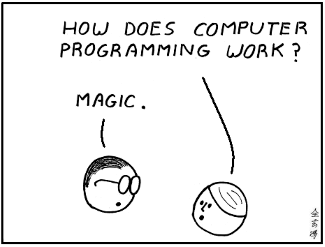

### Code as Material
# Creative Coding Foundations for Artistic and Design Practices

#### Prof. Dr. Lena Gieseke | lena.gieseke@filmuniversitaet.de  

---

  
[[learningliftoff]](https://www.learningliftoff.com/wp-content/uploads/2014/09/Prog.png)  

The workshop provides a fundamental introduction to programming with an emphasis on graphics, sound, and interaction. Using the p5.js framework, students develop essential programming skills while exploring code as an expressive medium.

Lecture and workshop invite students to consider computation not as a tool to master, but as a material to think and create with. What processes, aesthetics, and forms of authorship does code offer as a medium, and how does it shape contemporary artistic and design practice? In turn, how does artistic thinking shape code, and how can programming be positioned as a space for exploration, experimentation, and expression?

## Learning Objectives

With this course, you will gain

* An understanding of fundamental programming concepts and processes
* Skills to develop simple programs from scratch as creative artifacts
* An understanding of code as an expressive, aesthetic, and artistic medium
* Awareness of creative coding contexts, including historical developments and contemporary artistic practices

## Topics

Class topics can be divided into what you learn about programming itself and its *syntax* and what you do with your newly developed programming skill, meaning its application.

In regard to programming itself, we will cover:

* Commands, variables
* Events
* Conditions
* Loops
* Arrays
* Functions
* Maybe: Objects and Classes

We apply these programming skills to implement:

* Drawing, colors
* Interaction
* Movement / Animation
* Image, video
* Sound
  

Please note that topics are subject to change during the course!

### Schedule

TODO:

| Session | Topic               | Subtopics               |
| ------- | ------------------- | ----------------------- |
| 1       | Introductions       | Course                  |
|         |                     | Participants            |
|         |                     | Materials               |
|         | Setup               | p5.js Editor            |
|         |                     | Environment             |
|         |                     | System Loop             |
|         | Drawing             | Canvas                  |
|         |                     | Drawing Commands        |
|         |                     | Colors                  |
| 2       | Programming         | Why                     |
|         |                     | What                    |
|         |                     | Algorithms              |
|         |                     | Help From AI            |
|         | Program Flow        | Commands                |
|         |                     | Functions calls         |
|         |                     | Parentheses             |
|         |                     | Formatting              |
| 3       | Interaction         | Mouse                   |
|         |                     | Keyboard                |
|         |                     | if-else                 |
|         | Programming Example | Divide and conquer      |
|         |                     | Screen Clearing         |
|         | References          | Documentation           |
|         |                     | Discover OpenProcessing |
| 4       | Variables           | Data Types              |
|         |                     | Scope                   |
|         | Operators           | Example                 |
|         |                     | Modulo                  |
|         |                     | HSB                     |
| 5       | Loops               | while                   |
|         |                     | for                     |
|         |                     | 2D Loops                |
| 6       | Images I            | Loading & Displaying    |
|         | Arrays              | Loop over all elements  |
|         |                     | Example Confetti        |
|         | Images II           | Image Data              |
|         |                     | Pixel Data              |
|         |                     | Image Manipulations     |
| 7       | Functions           | Parameter               |
|         |                     | Return value            |
|         |                     | Why                     |
|         | Code Structure      |                         |
|         | Programming Example |                         |
| 8       | Libraries           | Loading                 |
|         |                     | Types                   |
|         | Sound               | Loading & Playing       |
|         |                     | Modes                   |
| 9       | Wrap-Up             |                         |
|         | Next Steps          |                         |
|         | Follow-Up Sessions  |                         |

## Time and Place

17/03, 14.00 - 18.00 (4h): workshop (room 32)  
18/03, 12.00 - 14.00 (2 h): lecture (CIB)  
18/03, 16.00 - 18.00 (2 h): workshop (room 32)  
19/03, 14.00 - 18.00 (4h): workshop (room 32)  
20/03, 14.00 - 18.00 (4h): workshop (room 32)  

## Policies

* **Plagiarism**: in programming and in times of AI-tools, the concept of plagiarism is relatively elusive. We are working with open-source tools and libraries, building upon the work of a multitude of people. You are encouraged and expected to tap into resources available online, and to copy-paste and tweak code you may not fully understand. However, it is categorically forbidden to outsource work to people outside the course or copy & paste, meaning plagiarize, assignments as a whole from others. 
* **Tools and utilities**: In general, you are allowed to use any tools you want, also AI-tools, but you are required to list and briefly describe the usage of such tools in your submission. However, in this class, I recommend that you follow my guidance on when to employ the help of an AI-tool and when not. Please, always make sure to utilize such tools for supporting your learning! 
* **Absences**: you are responsible for what happens in class whether you are here or not. I do not repeat content for you that you have missed because you were not in class.
* **Participation**: you are invited, encouraged, and expected to engage actively in discussion, reflection and activities. Also, you can exist for a few hours without chatting, texting or emailing on your computer and cellphone. I notice it and perceive it as quite rude if you don't pay attention, and I prefer that you only come to class if you are actually participating. 
* **Recording**: There are no recordings of the classes. No student may record any classroom activity without consent from me. If you have a disability such that you think you need to record classroom activities, get in touch with me.

[*Adapted from P. Pedercini with permission.*]

## Inclusivity Statement

It is my intent that students from all diverse backgrounds and perspectives are served by this course, and that the diversity that students bring to this class is viewed as a resource, strength and benefit.  

It is my intent to present activities that accommodate and value a diversity of gender, sexuality, disability, age, socioeconomic status, ethnicity, race, and culture. I gladly honor your request to address you by your preferred name and gender pronoun. I commit to make individual arrangements to address disabilities or religious needs (e.g. religious events in conflict with class meetings and deadlines). Please advise me of these preferences and needs early in the semester so that I may make appropriate changes to my plans and records.  

Debate and free exchange of ideas is encouraged, but I do not tolerate harassment, i.e. a pattern of behavior directed against a particular individual with the intent of humiliating or intimidating.

[*Adapted from P. Pedercini with permission.*]

## Last But Not Least

Next to all the super important learnings, also don't forget to have fun with this class! 🤩

